# System Architecture Document
## Hotel Booking Platform

**Version:** 1.0  
**Date:** June 17, 2026  
**Status:** Initial Design  
**Target Scale:** 100,000 concurrent users, 99.9% uptime

---

## Executive Summary

This document defines the system architecture for a comprehensive hotel booking platform consisting of three primary applications:
- **Mobile Application** (iOS/Android) - Customer-facing booking interface
- **Hotel Management Panel** (Web) - Property and inventory management
- **Super Admin Panel** (Web) - Platform operations and analytics

### Key Architectural Decisions

1. **Microservices Architecture** - Adopted to support scalability, independent deployment, and team autonomy
2. **Flutter for Mobile** - Single codebase for iOS/Android with native performance
3. **React for Web Panels** - Component reusability across admin and hotel panels
4. **PostgreSQL Primary Database** - ACID compliance for transactions, with Redis for caching
5. **Elasticsearch for Search** - Sub-2-second search performance for complex queries
6. **AWS Cloud Infrastructure** - Auto-scaling, high availability, and global reach
7. **Event-Driven Architecture** - Async communication via Amazon SQS/SNS for notifications and workflows
8. **API Gateway Pattern** - Single entry point with rate limiting, authentication, and routing

### Architectural Priorities

| Priority | Rationale |
|----------|-----------|
| **Scalability** | Must support 100K concurrent users with horizontal scaling |
| **Security** | PCI DSS compliance, GDPR/CCPA adherence, encrypted data at rest/transit |
| **Performance** | <2s search, <5s payment, <500ms API response (p95) |
| **Reliability** | 99.9% uptime with disaster recovery (RTO < 4h, RPO < 1h) |
| **Maintainability** | Service isolation, clear boundaries, automated CI/CD |

---

## 1. System Architecture Overview

### 1.1 System Context Diagram

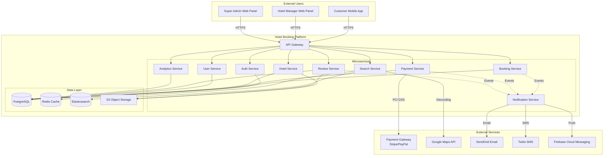

### 1.2 High-Level Component Architecture

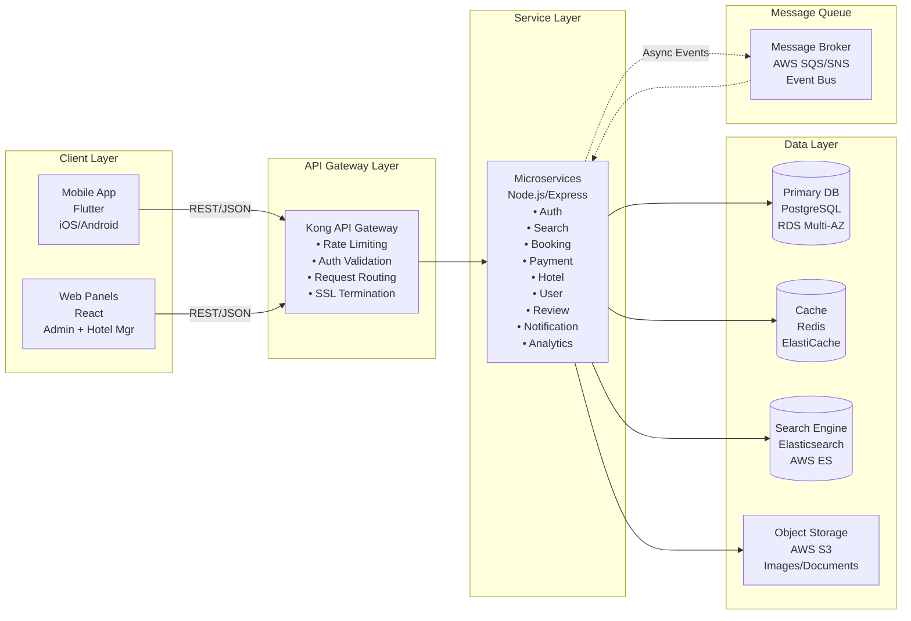

### 1.3 Technology Stack with Rationale

| Layer | Technology | Rationale | Requirements Addressed |
|-------|-----------|-----------|----------------------|
| **Mobile App** | Flutter 3.x | • Single codebase for iOS/Android (faster development)<br/>• Native performance<br/>• Hot reload for rapid iteration<br/>• Strong community and package ecosystem | REQ-001 to REQ-044, NFR-021 |
| **Web Frontend** | React 18 + TypeScript | • Component reusability across admin/hotel panels<br/>• Virtual DOM for performance<br/>• Large ecosystem (Material-UI, React Router)<br/>• TypeScript for type safety | REQ-045 to REQ-061, NFR-022 |
| **API Gateway** | Kong | • Open source, production-proven<br/>• Plugin ecosystem (auth, rate limiting, logging)<br/>• Low latency overhead<br/>• API versioning support | NFR-001, NFR-008, NFR-011 |
| **Backend Services** | Node.js 20 LTS + Express | • Non-blocking I/O for high concurrency<br/>• JavaScript/TypeScript across stack<br/>• NPM ecosystem for integrations<br/>• Excellent JSON handling | NFR-001, NFR-002, NFR-004 |
| **Primary Database** | PostgreSQL 15 (AWS RDS) | • ACID compliance for booking transactions<br/>• JSON support for flexible schemas<br/>• Robust indexing for query performance<br/>• Proven reliability and PITR backups | REQ-028 to REQ-037, NFR-011 |
| **Caching** | Redis 7 (ElastiCache) | • In-memory performance for hot data<br/>• Session storage for auth tokens<br/>• Cache invalidation patterns<br/>• Pub/Sub for real-time features | NFR-001, NFR-006 |
| **Search Engine** | Elasticsearch 8 | • Full-text search with filters (price, rating, amenities)<br/>• Geo-spatial queries for map view<br/>• Aggregations for faceted search<br/>• Sub-second response times at scale | REQ-009 to REQ-019, NFR-001 |
| **Object Storage** | AWS S3 | • Scalable image storage<br/>• CDN integration (CloudFront)<br/>• Lifecycle policies for cost optimization<br/>• 99.999999999% durability | REQ-020, NFR-003 |
| **Message Queue** | AWS SQS + SNS | • Async processing (email, SMS, push notifications)<br/>• Decoupling services for resilience<br/>• Retry logic and dead-letter queues<br/>• Serverless scaling | NFR-005, NFR-016, NFR-017 |
| **Payment Gateway** | Stripe + PayPal | • PCI DSS Level 1 certified<br/>• Strong fraud detection<br/>• Multiple payment methods support<br/>• Webhook integration for async updates | REQ-032, REQ-033, NFR-007 |
| **Email Service** | SendGrid | • 99% delivery rate<br/>• Template management<br/>• Webhook tracking (opens, clicks)<br/>• High throughput | REQ-035, NFR-017 |
| **SMS Service** | Twilio | • Global reach (190+ countries)<br/>• Two-way SMS for OTP<br/>• Delivery receipts<br/>• Programmable messaging | REQ-002, REQ-035, NFR-018 |
| **Push Notifications** | Firebase Cloud Messaging | • Cross-platform (iOS/Android)<br/>• Topic-based messaging<br/>• Analytics integration<br/>• Free tier for moderate volume | REQ-035, NFR-016 |
| **Maps Service** | Google Maps Platform | • Geocoding for address lookup<br/>• Static maps for thumbnails<br/>• Places API for autocomplete<br/>• Mature SDK for mobile | REQ-019, REQ-018 |
| **Monitoring** | AWS CloudWatch + DataDog | • Infrastructure metrics<br/>• Application logs centralization<br/>• Custom dashboards<br/>• Alerting on SLA breaches | NFR-011, NFR-020 |
| **CI/CD** | GitHub Actions + AWS CodePipeline | • Automated testing and deployment<br/>• Blue-green deployments<br/>• Rollback capabilities<br/>• Infrastructure as Code (Terraform) | NFR-020 |

---

## 2. Detailed Component Design

### 2.1 Mobile Application Architecture (Flutter)

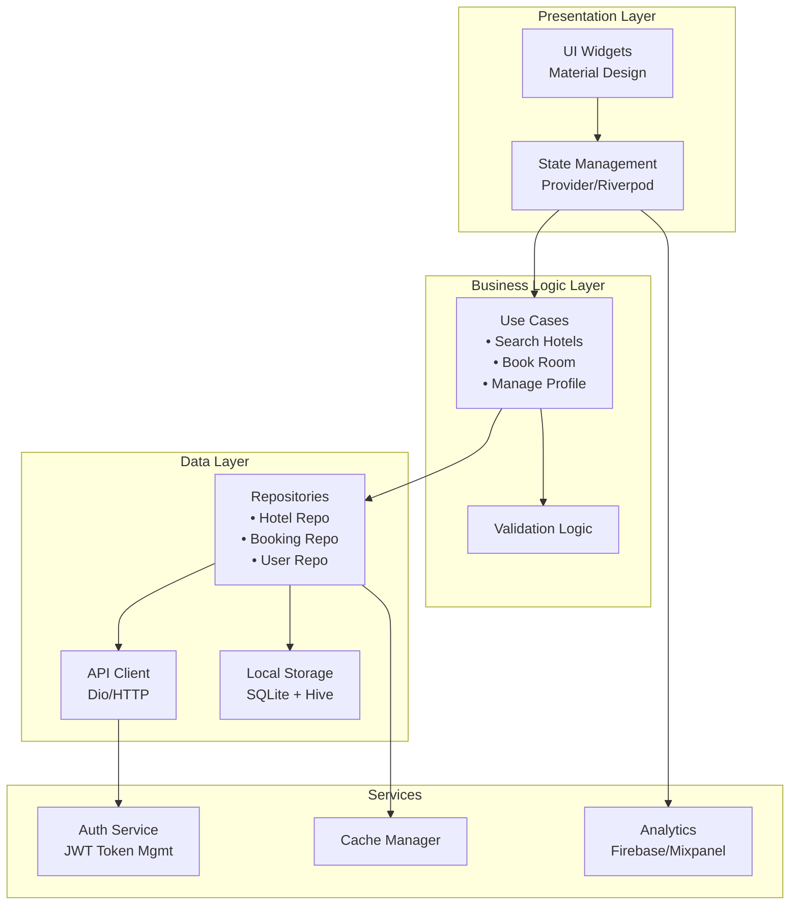

**Key Modules:**

| Module | Responsibility | Requirements |
|--------|---------------|-------------|
| **Authentication** | Login, registration, social auth, token refresh | REQ-001 to REQ-005 |
| **User Profile** | Profile CRUD, saved payment methods, preferences | REQ-006, REQ-007 |
| **Hotel Search** | Search UI, filters, sorting, map view | REQ-009 to REQ-019 |
| **Hotel Details** | Photo gallery, room listings, reviews | REQ-020 to REQ-027 |
| **Booking Flow** | Room selection, payment, confirmation | REQ-028 to REQ-037 |
| **My Bookings** | View, cancel, modify bookings | REQ-038 to REQ-042 |
| **Reviews** | Submit and view ratings/reviews | REQ-043, REQ-024 |
| **Notifications** | Push, in-app, notification center | NFR-016 |
| **Offline Mode** | View cached bookings without network | NFR-019 |

**State Management Strategy:**
- **Riverpod** for reactive state management
- **Immutable state** pattern for predictability
- **Code generation** for serialization (json_serializable)

**Security Features:**
- JWT tokens stored in Flutter Secure Storage (encrypted keychain/keystore)
- Certificate pinning for API communication
- Biometric authentication option (Face ID/Touch ID/Fingerprint)
- No sensitive data in logs or analytics

---

### 2.2 Backend Microservices Architecture

#### Service Decomposition

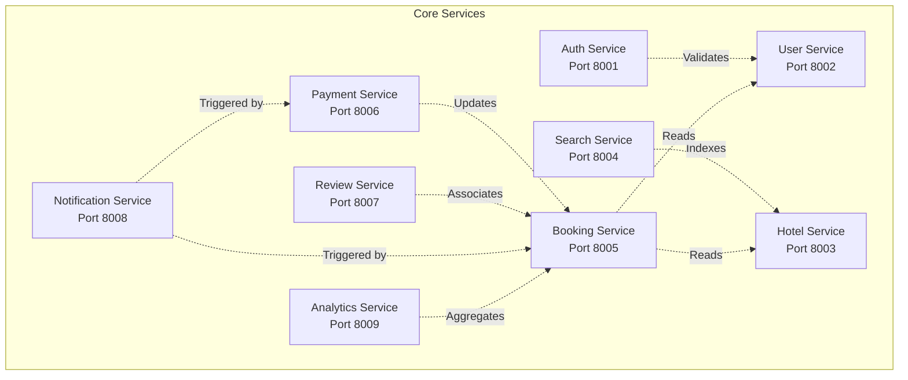

#### 2.2.1 Auth Service

**Responsibilities:**
- User authentication (email, phone, social OAuth)
- JWT token generation and validation
- Password recovery (OTP via email/SMS)
- Session management
- Role-based access control (Customer, Hotel Manager, Admin)

**API Endpoints:**
- `POST /api/v1/auth/register` - User registration (REQ-001, REQ-002)
- `POST /api/v1/auth/login` - Email/phone login
- `POST /api/v1/auth/social` - Google/Facebook OAuth (REQ-003, REQ-004)
- `POST /api/v1/auth/forgot-password` - Password recovery (REQ-005)
- `POST /api/v1/auth/reset-password` - Reset with OTP
- `POST /api/v1/auth/refresh-token` - Refresh JWT
- `POST /api/v1/auth/logout` - Token invalidation

**Data Model:**
```typescript
interface User {
  id: UUID;
  email?: string;
  phone?: string;
  passwordHash?: string; // bcrypt
  socialProvider?: 'google' | 'facebook';
  socialId?: string;
  role: 'customer' | 'hotel_manager' | 'admin';
  isVerified: boolean;
  createdAt: timestamp;
  lastLogin: timestamp;
}

interface Session {
  id: UUID;
  userId: UUID;
  token: string; // JWT
  refreshToken: string;
  expiresAt: timestamp;
  deviceInfo: object;
}
```

**Security Measures:**
- bcrypt for password hashing (cost factor 12)
- JWT with 15-minute access token, 7-day refresh token
- Rate limiting: 5 failed login attempts → 15-minute lockout
- OAuth 2.0 with PKCE for social login
- Redis for token blacklist on logout

**Requirements Addressed:** REQ-001, REQ-002, REQ-003, REQ-004, REQ-005, NFR-009

---

#### 2.2.2 User Service

**Responsibilities:**
- User profile management
- Saved payment methods (tokenized)
- User preferences
- Booking history access

**API Endpoints:**
- `GET /api/v1/users/:id` - Get profile (REQ-006)
- `PUT /api/v1/users/:id` - Update profile (REQ-006)
- `POST /api/v1/users/:id/payment-methods` - Add payment method (REQ-007)
- `GET /api/v1/users/:id/payment-methods` - List saved methods
- `DELETE /api/v1/users/:id/payment-methods/:pmId` - Remove method
- `GET /api/v1/users/:id/bookings` - Booking history (REQ-008)
- `GET /api/v1/users/:id/preferences` - Get preferences
- `PUT /api/v1/users/:id/preferences` - Update preferences

**Data Model:**
```typescript
interface UserProfile {
  userId: UUID;
  firstName: string;
  lastName: string;
  phone: string;
  email: string;
  dateOfBirth?: date;
  nationality?: string;
  profilePicture?: string; // S3 URL
  preferences: {
    currency: string; // 'USD' for V1
    language: string; // 'en' for V1
    notifications: {
      email: boolean;
      sms: boolean;
      push: boolean;
    };
  };
  createdAt: timestamp;
  updatedAt: timestamp;
}

interface PaymentMethod {
  id: UUID;
  userId: UUID;
  provider: 'stripe' | 'paypal';
  tokenId: string; // Provider token (not actual card)
  last4: string; // Last 4 digits for display
  cardType: string; // 'visa', 'mastercard', etc.
  expiryMonth: number;
  expiryYear: number;
  isDefault: boolean;
  createdAt: timestamp;
}
```

**Security:**
- No full card numbers stored (PCI DSS compliance)
- Payment tokens from Stripe/PayPal vault
- Encryption at rest for PII (AES-256)

**Requirements Addressed:** REQ-006, REQ-007, REQ-008, NFR-007, NFR-010

---

#### 2.2.3 Hotel Service

**Responsibilities:**
- Hotel listings management
- Room inventory and pricing
- Hotel profiles and amenities
- Availability management
- Photo uploads and management

**API Endpoints:**
- `GET /api/v1/hotels/:id` - Hotel details (REQ-020 to REQ-027)
- `GET /api/v1/hotels/:id/rooms` - Room types and pricing (REQ-022)
- `GET /api/v1/hotels/:id/availability` - Check availability
- `POST /api/v1/hotels` - Create hotel (admin/manager)
- `PUT /api/v1/hotels/:id` - Update hotel (REQ-047)
- `POST /api/v1/hotels/:id/photos` - Upload photos (REQ-020)
- `PUT /api/v1/hotels/:id/rooms/:roomId` - Update room (REQ-048)
- `POST /api/v1/hotels/:id/block-dates` - Block dates (REQ-049)
- `GET /api/v1/hotels/:id/bookings` - Hotel bookings (REQ-050)

**Data Model:**
```typescript
interface Hotel {
  id: UUID;
  name: string;
  description: text;
  address: {
    street: string;
    city: string;
    state: string;
    country: string;
    zipCode: string;
    latitude: decimal;
    longitude: decimal;
  };
  contactInfo: {
    phone: string;
    email: string;
    website?: string;
  };
  starRating: number; // 1-5
  propertyType: 'hotel' | 'resort' | 'hostel' | 'apartment';
  amenities: string[]; // ['wifi', 'pool', 'parking', 'ac', 'breakfast', 'gym', 'pet-friendly']
  photos: {
    url: string; // S3 URL
    caption?: string;
    order: number;
  }[];
  policies: {
    checkInTime: time;
    checkOutTime: time;
    cancellationPolicy: text;
    childPolicy?: text;
    petPolicy?: text;
  };
  managerId: UUID; // Reference to manager user
  status: 'pending' | 'approved' | 'rejected' | 'suspended';
  isVerified: boolean;
  averageRating: decimal; // Computed
  totalReviews: number; // Computed
  createdAt: timestamp;
  updatedAt: timestamp;
}

interface Room {
  id: UUID;
  hotelId: UUID;
  roomType: 'standard' | 'deluxe' | 'suite';
  name: string;
  description: text;
  maxGuests: number;
  bedType: string; // 'king', 'queen', 'twin', etc.
  pricePerNight: decimal;
  totalRooms: number; // Inventory
  amenities: string[];
  photos: string[]; // S3 URLs
  isActive: boolean;
}

interface DateBlock {
  id: UUID;
  hotelId: UUID;
  roomId?: UUID; // null = all rooms
  startDate: date;
  endDate: date;
  reason: string;
  createdAt: timestamp;
}
```

**Caching Strategy:**
- Redis cache for hotel details (TTL 1 hour)
- Cache invalidation on hotel updates
- CDN (CloudFront) for image delivery

**Requirements Addressed:** REQ-020 to REQ-027, REQ-045 to REQ-053, NFR-003

---

#### 2.2.4 Search Service

**Responsibilities:**
- Hotel search with filters and sorting
- Elasticsearch index management
- Geo-spatial queries for map view
- Autocomplete for destinations
- Price range aggregations

**API Endpoints:**
- `POST /api/v1/search` - Search hotels (REQ-009)
- `POST /api/v1/search/filters` - Apply filters (REQ-010 to REQ-014)
- `GET /api/v1/search/autocomplete` - Destination autocomplete
- `GET /api/v1/search/map` - Map view data (REQ-019)

**Search Request Schema:**
```typescript
interface SearchRequest {
  destination: {
    city?: string;
    coordinates?: { lat: decimal; lng: decimal };
    radius?: number; // km
  };
  checkIn: date;
  checkOut: date;
  guests: number;
  rooms: number;
  filters?: {
    priceRange?: { min: decimal; max: decimal }; // REQ-010
    starRating?: number[]; // [3, 4, 5] REQ-011
    amenities?: string[]; // ['wifi', 'pool'] REQ-012
    propertyType?: string[]; // ['hotel', 'resort'] REQ-013
    cancellationPolicy?: 'free' | 'non-refundable'; // REQ-014
  };
  sort?: 'price_asc' | 'price_desc' | 'rating' | 'popularity' | 'distance'; // REQ-015 to REQ-018
  page: number;
  pageSize: number;
}

interface SearchResponse {
  results: {
    hotelId: UUID;
    name: string;
    starRating: number;
    averageRating: decimal;
    reviewCount: number;
    pricePerNight: decimal;
    distance?: decimal; // km from search center
    thumbnailUrl: string;
    amenities: string[];
    cancellationPolicy: string;
  }[];
  totalResults: number;
  filters: {
    priceRange: { min: decimal; max: decimal };
    availableAmenities: string[];
    starRatings: number[];
  };
}
```

**Elasticsearch Index Structure:**
```json
{
  "mappings": {
    "properties": {
      "hotelId": { "type": "keyword" },
      "name": { "type": "text", "analyzer": "standard" },
      "location": { "type": "geo_point" },
      "city": { "type": "keyword" },
      "starRating": { "type": "integer" },
      "averageRating": { "type": "float" },
      "pricePerNight": { "type": "float" },
      "amenities": { "type": "keyword" },
      "propertyType": { "type": "keyword" },
      "cancellationPolicy": { "type": "keyword" },
      "popularity": { "type": "integer" },
      "availability": {
        "type": "nested",
        "properties": {
          "date": { "type": "date" },
          "roomsAvailable": { "type": "integer" }
        }
      }
    }
  }
}
```

**Performance Optimizations:**
- Elasticsearch with 3-node cluster for redundancy
- Query result caching in Redis (5-minute TTL)
- Pagination with cursor-based approach for deep pages
- Async index updates via message queue

**Requirements Addressed:** REQ-009 to REQ-019, NFR-001, NFR-006

---

#### 2.2.5 Booking Service

**Responsibilities:**
- Booking creation and management
- Inventory locking during booking flow
- Booking cancellation and refund calculation
- Booking modification
- Check-in/check-out status tracking

**API Endpoints:**
- `POST /api/v1/bookings` - Create booking (REQ-028)
- `GET /api/v1/bookings/:id` - Booking details
- `PUT /api/v1/bookings/:id/cancel` - Cancel booking (REQ-036, REQ-040)
- `PUT /api/v1/bookings/:id/modify` - Modify booking (REQ-037)
- `PUT /api/v1/bookings/:id/guests` - Update guest details (REQ-041)
- `GET /api/v1/bookings/:id/price-breakdown` - Price details (REQ-030)
- `POST /api/v1/bookings/:id/check-in` - Mark check-in (REQ-050)
- `POST /api/v1/bookings/:id/check-out` - Mark check-out (REQ-050)

**Booking Flow Sequence:**

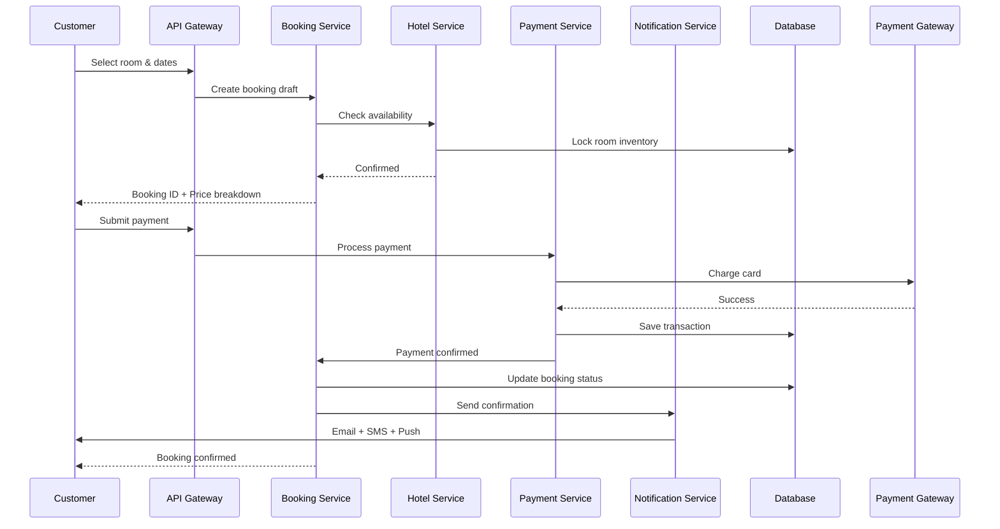

**Data Model:**
```typescript
interface Booking {
  id: UUID;
  bookingReference: string; // e.g., "BK-2026-123456"
  userId: UUID;
  hotelId: UUID;
  roomId: UUID;
  status: 'draft' | 'pending_payment' | 'confirmed' | 'checked_in' | 'checked_out' | 'cancelled' | 'no_show';
  
  dates: {
    checkIn: date;
    checkOut: date;
    nights: number;
  };
  
  guests: {
    adults: number;
    children: number;
    rooms: number;
  };
  
  guestDetails?: {
    firstName: string;
    lastName: string;
    email: string;
    phone: string;
  }[];
  
  specialRequests?: text; // REQ-029
  
  pricing: {
    basePrice: decimal; // Room price * nights
    taxes: decimal;
    serviceFee: decimal;
    discount?: decimal; // From promo code
    total: decimal;
  };
  
  promoCode?: string; // REQ-031
  
  cancellationPolicy: {
    type: 'free' | 'partial' | 'non-refundable';
    deadline?: timestamp;
    refundPercentage?: number;
  };
  
  paymentId?: UUID; // Reference to payment transaction
  
  createdAt: timestamp;
  updatedAt: timestamp;
  confirmedAt?: timestamp;
  cancelledAt?: timestamp;
  checkedInAt?: timestamp;
  checkedOutAt?: timestamp;
}
```

**Inventory Management:**
- Pessimistic locking with 15-minute timeout
- Distributed lock via Redis
- Automatic release on payment failure or timeout
- Real-time availability sync to search index

**Cancellation Logic:**
```typescript
function calculateRefund(booking: Booking): decimal {
  const now = new Date();
  const policy = booking.cancellationPolicy;
  
  if (policy.type === 'non-refundable') {
    return 0;
  }
  
  if (policy.type === 'free' && now < policy.deadline) {
    return booking.pricing.total;
  }
  
  if (policy.type === 'partial' && now < policy.deadline) {
    return booking.pricing.total * (policy.refundPercentage / 100);
  }
  
  return 0; // Past deadline
}
```

**Requirements Addressed:** REQ-028 to REQ-042, NFR-002

---

#### 2.2.6 Payment Service

**Responsibilities:**
- Payment processing via Stripe and PayPal
- PCI DSS compliant token handling
- Refund processing
- Payment method management
- Transaction history

**API Endpoints:**
- `POST /api/v1/payments/intent` - Create payment intent (REQ-032)
- `POST /api/v1/payments/process` - Process payment
- `POST /api/v1/payments/refund` - Issue refund (REQ-036)
- `GET /api/v1/payments/:id` - Payment details
- `POST /api/v1/payments/webhook` - Payment gateway webhooks

**Payment Flow:**

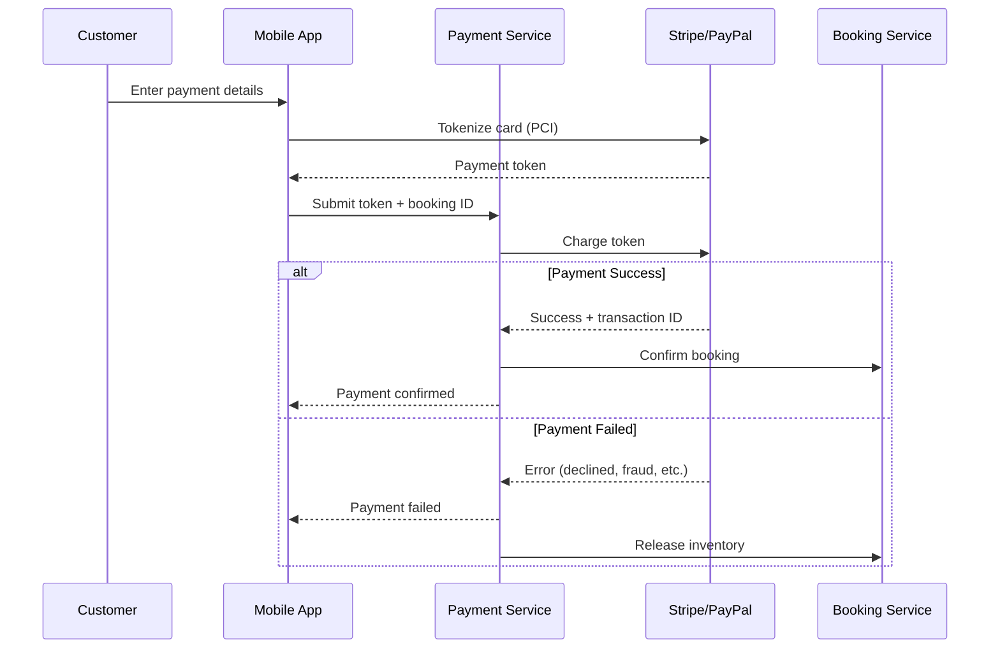

**Data Model:**
```typescript
interface Payment {
  id: UUID;
  bookingId: UUID;
  userId: UUID;
  provider: 'stripe' | 'paypal';
  providerTransactionId: string;
  
  amount: decimal;
  currency: string; // 'USD' for V1
  
  paymentMethod: {
    type: 'card' | 'paypal' | 'gpay' | 'apple_pay';
    last4?: string;
    brand?: string;
  };
  
  status: 'pending' | 'processing' | 'succeeded' | 'failed' | 'refunded' | 'partially_refunded';
  
  refunds?: {
    id: UUID;
    amount: decimal;
    reason: string;
    processedAt: timestamp;
  }[];
  
  metadata: {
    ipAddress: string;
    userAgent: string;
    fraudScore?: number;
  };
  
  createdAt: timestamp;
  processedAt?: timestamp;
}
```

**Security & Compliance:**
- **PCI DSS Level 1:** No card data stored; use Stripe/PayPal tokenization
- **3D Secure (3DS):** Enforced for European cards (SCA compliance)
- **Fraud Detection:** Stripe Radar for risk scoring
- **Encryption:** TLS 1.3 for data in transit, AES-256 at rest
- **Audit Logging:** All payment operations logged to immutable storage

**Payment Methods:**
- **Credit/Debit Card:** Stripe (REQ-032)
- **PayPal:** PayPal API (REQ-033)
- **Google Pay:** Stripe integration (REQ-033)
- **Apple Pay:** Stripe integration (REQ-033)
- **Pay at Hotel:** Booking confirmed without payment (REQ-034)

**Requirements Addressed:** REQ-032, REQ-033, REQ-034, REQ-036, NFR-002, NFR-007

---

#### 2.2.7 Review Service

**Responsibilities:**
- Review submission and moderation
- Rating aggregation
- Review responses from hotels
- Review sorting and filtering

**API Endpoints:**
- `POST /api/v1/reviews` - Submit review (REQ-043)
- `GET /api/v1/reviews/hotel/:hotelId` - Hotel reviews (REQ-024)
- `GET /api/v1/reviews/:id` - Review details
- `PUT /api/v1/reviews/:id/respond` - Hotel response (REQ-052)
- `PUT /api/v1/reviews/:id/moderate` - Admin moderation
- `GET /api/v1/reviews/hotel/:hotelId/summary` - Rating summary

**Data Model:**
```typescript
interface Review {
  id: UUID;
  bookingId: UUID;
  userId: UUID;
  hotelId: UUID;
  
  rating: number; // 1-5
  
  reviewText: text;
  
  photos?: string[]; // S3 URLs (optional)
  
  categories?: {
    cleanliness: number; // 1-5
    comfort: number;
    location: number;
    service: number;
    valueForMoney: number;
  };
  
  status: 'pending' | 'approved' | 'rejected';
  moderationReason?: string;
  
  hotelResponse?: {
    text: text;
    respondedAt: timestamp;
    respondedBy: UUID; // Manager ID
  };
  
  helpfulCount: number; // Upvotes
  
  createdAt: timestamp;
  updatedAt: timestamp;
}

interface RatingSummary {
  hotelId: UUID;
  averageRating: decimal;
  totalReviews: number;
  ratingDistribution: {
    '5': number;
    '4': number;
    '3': number;
    '2': number;
    '1': number;
  };
  categoryAverages: {
    cleanliness: decimal;
    comfort: decimal;
    location: decimal;
    service: decimal;
    valueForMoney: decimal;
  };
}
```

**Review Validation:**
- User must have completed booking to review
- One review per booking
- Profanity filter and spam detection
- Admin moderation queue for new reviews

**Requirements Addressed:** REQ-024, REQ-025, REQ-043, REQ-052

---

#### 2.2.8 Notification Service

**Responsibilities:**
- Email notifications via SendGrid
- SMS notifications via Twilio
- Push notifications via Firebase Cloud Messaging
- Event-driven notification triggers
- Notification preferences management

**API Endpoints:**
- `POST /api/v1/notifications/send` - Internal API for sending
- `GET /api/v1/notifications/user/:userId` - User notification history
- `PUT /api/v1/notifications/user/:userId/preferences` - Update preferences

**Notification Events:**

| Event | Trigger | Channels | Template | Requirements |
|-------|---------|----------|----------|--------------|
| **Booking Confirmed** | Payment success | Email, SMS, Push | Booking details + confirmation number | REQ-035, NFR-016, NFR-017 |
| **Booking Reminder** | 24h before check-in | Email, Push | Check-in time + address | NFR-016 |
| **Booking Cancelled** | User/hotel cancellation | Email, SMS, Push | Refund details + cancellation policy | REQ-036 |
| **Payment Failed** | Payment declined | Email, Push | Retry instructions | NFR-002 |
| **Review Request** | 24h after check-out | Email, Push | Review link + incentive | REQ-043 |
| **New Review Response** | Hotel responds | Email, Push | Response text | REQ-052 |
| **Promotional Offer** | Admin triggers | Email, Push | Promo code + terms | REQ-059 |
| **OTP Verification** | Registration/password reset | SMS, Email | OTP code + expiry | REQ-002, REQ-005 |

**Message Queue Integration:**

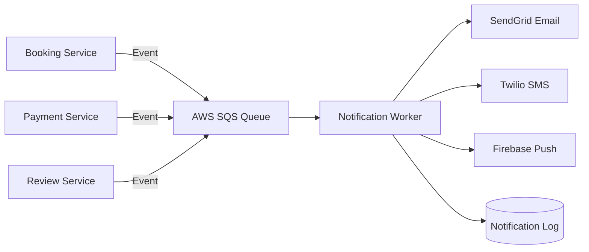

**Data Model:**
```typescript
interface Notification {
  id: UUID;
  userId: UUID;
  type: 'booking_confirmed' | 'booking_cancelled' | 'payment_failed' | 'review_request' | 'promo' | 'reminder';
  
  channels: {
    email?: {
      to: string;
      subject: string;
      body: string;
      sentAt?: timestamp;
      status: 'pending' | 'sent' | 'failed';
    };
    sms?: {
      to: string;
      message: string;
      sentAt?: timestamp;
      status: 'pending' | 'sent' | 'failed';
    };
    push?: {
      title: string;
      body: string;
      data: object;
      sentAt?: timestamp;
      status: 'pending' | 'sent' | 'failed';
    };
  };
  
  metadata: {
    bookingId?: UUID;
    hotelId?: UUID;
  };
  
  createdAt: timestamp;
}
```

**Delivery SLA:**
- **Email:** 99% delivery within 1 minute (NFR-017)
- **SMS:** 95% delivery within 30 seconds (NFR-018)
- **Push:** 98% delivery within 10 seconds (NFR-016)

**Retry Logic:**
- Exponential backoff for failed sends
- Dead-letter queue after 3 retries
- Manual investigation for DLQ items

**Requirements Addressed:** REQ-002, REQ-005, REQ-035, NFR-016, NFR-017, NFR-018

---

#### 2.2.9 Analytics Service

**Responsibilities:**
- Platform-wide analytics and reporting
- Hotel performance metrics
- Revenue reporting and commission calculation
- User behavior tracking
- Data warehouse ETL

**API Endpoints:**
- `GET /api/v1/analytics/dashboard` - Admin dashboard (REQ-060)
- `GET /api/v1/analytics/hotel/:hotelId` - Hotel metrics (REQ-046)
- `GET /api/v1/analytics/revenue` - Revenue report (REQ-053)
- `GET /api/v1/analytics/users` - User growth
- `GET /api/v1/analytics/bookings` - Booking trends

**Key Metrics:**

| Metric | Description | Calculation | Stakeholder |
|--------|-------------|-------------|-------------|
| **Gross Booking Value (GBV)** | Total booking revenue | SUM(booking.total) | Admin, Finance |
| **Commission Revenue** | Platform earnings | GBV × commission_rate | Admin, Finance |
| **Conversion Rate** | Search to booking | (Bookings / Searches) × 100 | Admin, Product |
| **Average Booking Value** | Mean transaction size | GBV / total_bookings | Admin, Hotel |
| **Occupancy Rate** | Rooms booked vs available | (Booked rooms / Total rooms) × 100 | Hotel Manager |
| **Cancellation Rate** | Cancelled bookings | (Cancelled / Total) × 100 | Admin, Hotel |
| **User Retention (30-day)** | Returning users | (Repeat users / Total) × 100 | Admin, Product |
| **Popular Hotels** | Top by bookings | ORDER BY booking_count DESC | Admin, Hotel |

**Data Warehouse:**
- **ETL Pipeline:** Nightly batch job from PostgreSQL to AWS Redshift
- **Historical Data:** 5 years retention for compliance
- **BI Tools:** Tableau/Metabase for visual dashboards

**Requirements Addressed:** REQ-046, REQ-053, REQ-060, NFR-020

---

### 2.3 Web Admin Panel Architecture (React)

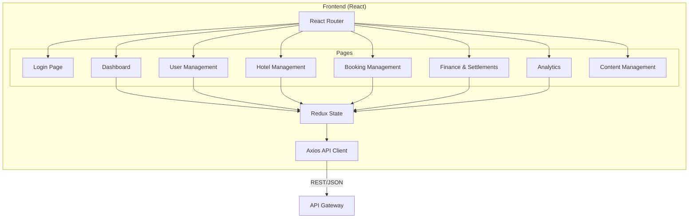

**Two Panel Types:**

| Panel | Users | Features | Requirements |
|-------|-------|----------|--------------|
| **Super Admin Panel** | Platform administrators | User management, hotel approval, disputes, analytics, promo codes | REQ-054 to REQ-061 |
| **Hotel Manager Panel** | Hotel owners/managers | Dashboard, hotel profile, room inventory, bookings, earnings | REQ-045 to REQ-053 |

**Shared Components:**
- Authentication (JWT-based)
- Navigation sidebar
- Data tables with pagination/sorting/filtering
- Form validation (React Hook Form)
- Charts and graphs (Chart.js/Recharts)
- File upload (drag-and-drop)

**Security:**
- Role-based component rendering
- Protected routes with auth guards
- CSRF tokens for state-changing operations
- Session timeout after 30 minutes inactivity

**Requirements Addressed:** REQ-045 to REQ-061, NFR-013, NFR-022

---

## 3. Data Architecture

### 3.1 Database Schema (PostgreSQL)

**Entity Relationship Diagram:**

```mermaid
erDiagram
    USERS ||--o{ BOOKINGS : places
    USERS ||--o{ REVIEWS : writes
    USERS ||--o{ PAYMENT_METHODS : owns
    USERS ||--|| USER_PROFILES : has
    
    HOTELS ||--o{ ROOMS : contains
    HOTELS ||--o{ BOOKINGS : receives
    HOTELS ||--o{ REVIEWS : receives
    HOTELS ||--o{ DATE_BLOCKS : has
    HOTELS ||--o{ PHOTOS : has
    HOTELS }o--|| USERS : managed_by
    
    ROOMS ||--o{ BOOKINGS : booked
    
    BOOKINGS ||--|| PAYMENTS : has
    BOOKINGS ||--o{ REVIEWS : generates
    
    ADMINS ||--o{ HOTELS : approves
    ADMINS ||--o{ PROMO_CODES : creates
    ADMINS ||--o{ DISPUTES : resolves
    
    USERS {
        uuid id PK
        string email UK
        string phone UK
        string password_hash
        enum role
        boolean is_verified
        timestamp created_at
    }
    
    USER_PROFILES {
        uuid user_id PK_FK
        string first_name
        string last_name
        date date_of_birth
        string nationality
        string profile_picture
        jsonb preferences
    }
    
    HOTELS {
        uuid id PK
        string name
        text description
        jsonb address
        jsonb contact_info
        integer star_rating
        string property_type
        text[] amenities
        jsonb policies
        uuid manager_id FK
        enum status
        boolean is_verified
        decimal average_rating
        integer total_reviews
    }
    
    ROOMS {
        uuid id PK
        uuid hotel_id FK
        string room_type
        string name
        integer max_guests
        decimal price_per_night
        integer total_rooms
        text[] amenities
        boolean is_active
    }
    
    BOOKINGS {
        uuid id PK
        string booking_reference UK
        uuid user_id FK
        uuid hotel_id FK
        uuid room_id FK
        enum status
        date check_in
        date check_out
        integer nights
        jsonb guests
        jsonb guest_details
        text special_requests
        jsonb pricing
        string promo_code
        jsonb cancellation_policy
        uuid payment_id FK
    }
    
    PAYMENTS {
        uuid id PK
        uuid booking_id FK
        uuid user_id FK
        string provider
        string provider_transaction_id
        decimal amount
        string currency
        enum status
        jsonb payment_method
        jsonb metadata
    }
    
    REVIEWS {
        uuid id PK
        uuid booking_id FK
        uuid user_id FK
        uuid hotel_id FK
        integer rating
        text review_text
        jsonb categories
        enum status
        jsonb hotel_response
        integer helpful_count
    }
    
    PROMO_CODES {
        uuid id PK
        string code UK
        enum discount_type
        decimal discount_value
        date valid_from
        date valid_until
        integer usage_limit
        integer usage_count
    }
```

**Key Database Design Decisions:**

1. **UUID Primary Keys:** For distributed system compatibility and obfuscation
2. **JSONB for Flexible Data:** Address, preferences, metadata (better than EAV)
3. **Denormalization:** `average_rating` and `total_reviews` in Hotels table (performance)
4. **Soft Deletes:** `deleted_at` column instead of hard deletes (audit trail)
5. **Indexes:**
   - B-tree: `users.email`, `bookings.booking_reference`, `hotels.status`
   - GiST: `hotels.address->>'latitude'`, `hotels.address->>'longitude'` (geo queries)
   - GIN: `hotels.amenities` (array contains queries)
6. **Partitioning:** Bookings table partitioned by `created_at` (yearly) for performance

### 3.2 Caching Strategy (Redis)

**Cache Layers:**

| Data Type | Cache Key Pattern | TTL | Invalidation Strategy | Purpose |
|-----------|-------------------|-----|----------------------|---------|
| **Hotel Details** | `hotel:{id}` | 1 hour | On hotel update | Reduce DB load for frequently viewed hotels |
| **Search Results** | `search:{hash(query)}` | 5 minutes | Time-based | Cache identical searches |
| **User Session** | `session:{token}` | 15 minutes | On logout | Fast auth validation |
| **Room Availability** | `availability:{hotelId}:{date}` | 10 minutes | On booking/cancellation | Real-time inventory |
| **Rating Summary** | `rating:{hotelId}` | 1 hour | On new review | Reduce aggregation queries |
| **Promo Codes** | `promo:{code}` | 24 hours | On code update | Fast lookup for bookings |

**Cache-Aside Pattern:**
```typescript
async function getHotel(id: UUID): Promise<Hotel> {
  // Try cache first
  const cached = await redis.get(`hotel:${id}`);
  if (cached) {
    return JSON.parse(cached);
  }
  
  // Cache miss - fetch from DB
  const hotel = await db.hotels.findById(id);
  
  // Write to cache
  await redis.setex(`hotel:${id}`, 3600, JSON.stringify(hotel));
  
  return hotel;
}
```

### 3.3 Search Index (Elasticsearch)

**Index Mapping** (Detailed):
```json
{
  "settings": {
    "number_of_shards": 3,
    "number_of_replicas": 2,
    "analysis": {
      "analyzer": {
        "hotel_name_analyzer": {
          "type": "custom",
          "tokenizer": "standard",
          "filter": ["lowercase", "asciifolding", "edge_ngram_filter"]
        }
      },
      "filter": {
        "edge_ngram_filter": {
          "type": "edge_ngram",
          "min_gram": 2,
          "max_gram": 10
        }
      }
    }
  },
  "mappings": {
    "properties": {
      "hotelId": { "type": "keyword" },
      "name": { 
        "type": "text", 
        "analyzer": "hotel_name_analyzer",
        "fields": {
          "keyword": { "type": "keyword" }
        }
      },
      "description": { "type": "text", "analyzer": "english" },
      "location": { "type": "geo_point" },
      "city": { "type": "keyword" },
      "state": { "type": "keyword" },
      "country": { "type": "keyword" },
      "starRating": { "type": "integer" },
      "averageRating": { "type": "float" },
      "reviewCount": { "type": "integer" },
      "pricePerNight": { "type": "float" },
      "amenities": { "type": "keyword" },
      "propertyType": { "type": "keyword" },
      "cancellationPolicy": { "type": "keyword" },
      "isVerified": { "type": "boolean" },
      "popularity": { "type": "integer" },
      "availability": {
        "type": "nested",
        "properties": {
          "date": { "type": "date", "format": "yyyy-MM-dd" },
          "roomType": { "type": "keyword" },
          "roomsAvailable": { "type": "integer" },
          "pricePerNight": { "type": "float" }
        }
      }
    }
  }
}
```

**Search Query Example** (with all filters):
```json
{
  "query": {
    "bool": {
      "must": [
        { "match": { "city": "New York" } },
        {
          "nested": {
            "path": "availability",
            "query": {
              "bool": {
                "must": [
                  { "range": { "availability.date": { "gte": "2026-07-01", "lte": "2026-07-05" } } },
                  { "range": { "availability.roomsAvailable": { "gte": 2 } } }
                ]
              }
            }
          }
        }
      ],
      "filter": [
        { "range": { "pricePerNight": { "gte": 50, "lte": 200 } } },
        { "terms": { "starRating": [4, 5] } },
        { "terms": { "amenities": ["wifi", "pool", "parking"] } },
        { "term": { "propertyType": "hotel" } },
        { "term": { "cancellationPolicy": "free" } }
      ]
    }
  },
  "sort": [
    { "pricePerNight": { "order": "asc" } }
  ],
  "from": 0,
  "size": 20
}
```

**Index Synchronization:**
- Asynchronous updates via SQS queue when hotel data changes
- Bulk re-indexing nightly for consistency
- Availability updated every 10 minutes from booking service

---

## 4. Data Flow & Integration

### 4.1 Key User Flows

#### 4.1.1 Complete Booking Flow

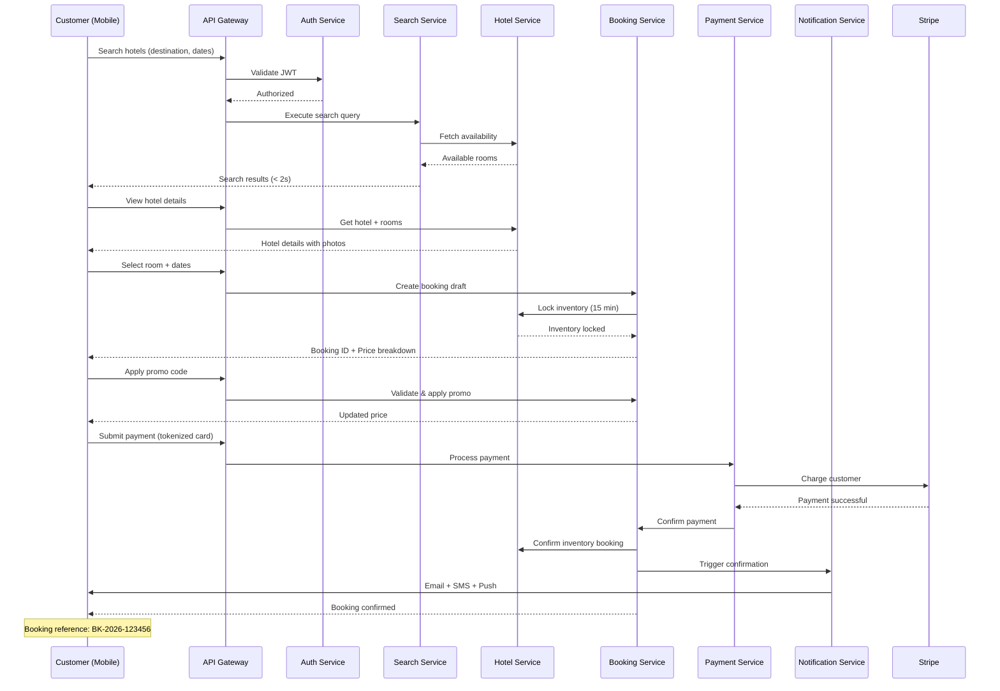

#### 4.1.2 Hotel Manager Dashboard Flow

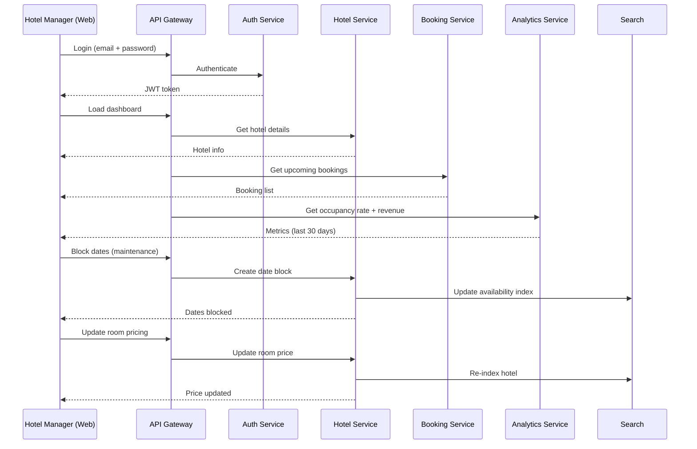

#### 4.1.3 Admin Approval Flow

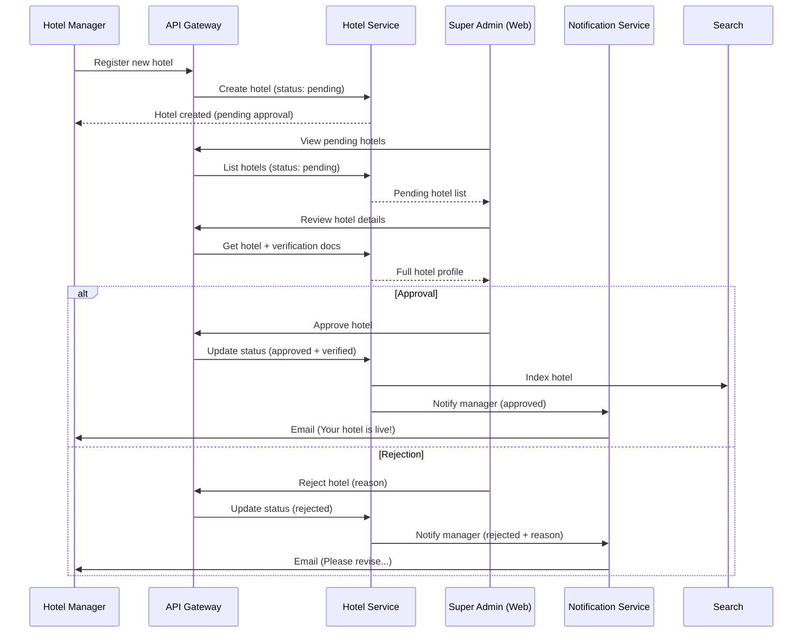

### 4.2 API Design Patterns

**RESTful API Conventions:**

| Method | Endpoint | Purpose | Idempotent | Request Body | Response |
|--------|----------|---------|------------|--------------|----------|
| GET | `/api/v1/hotels` | List hotels | Yes | - | 200 + array |
| GET | `/api/v1/hotels/:id` | Get hotel | Yes | - | 200 + object |
| POST | `/api/v1/hotels` | Create hotel | No | Hotel data | 201 + object |
| PUT | `/api/v1/hotels/:id` | Replace hotel | Yes | Full hotel data | 200 + object |
| PATCH | `/api/v1/hotels/:id` | Update hotel | No | Partial data | 200 + object |
| DELETE | `/api/v1/hotels/:id` | Delete hotel | Yes | - | 204 |

**Error Response Format:**
```json
{
  "error": {
    "code": "BOOKING_NOT_FOUND",
    "message": "Booking with ID 12345 does not exist",
    "details": {
      "bookingId": "12345"
    },
    "timestamp": "2026-06-17T10:30:00Z",
    "path": "/api/v1/bookings/12345"
  }
}
```

**Pagination:**
```json
{
  "data": [...],
  "pagination": {
    "page": 1,
    "pageSize": 20,
    "totalItems": 156,
    "totalPages": 8
  },
  "links": {
    "self": "/api/v1/hotels?page=1&pageSize=20",
    "next": "/api/v1/hotels?page=2&pageSize=20",
    "last": "/api/v1/hotels?page=8&pageSize=20"
  }
}
```

**API Versioning:**
- URI versioning: `/api/v1/...`, `/api/v2/...`
- V1 supported for 12 months after V2 launch
- Deprecation headers in V1 responses: `Sunset: Sat, 31 Dec 2027 23:59:59 GMT`

### 4.3 Third-Party Integrations

| Service | Provider | Purpose | Integration Method | SLA | Fallback |
|---------|----------|---------|-------------------|-----|----------|
| **Payment** | Stripe | Card processing | REST API + Webhooks | 99.99% | PayPal |
| **Payment** | PayPal | Wallet payments | PayPal SDK + REST API | 99.9% | Manual |
| **Maps** | Google Maps | Geocoding, map view | Google Maps API | 99.9% | Cached data |
| **Email** | SendGrid | Transactional emails | REST API | 99.95% | AWS SES |
| **SMS** | Twilio | OTP, notifications | Twilio API | 99.95% | Manual |
| **Push** | Firebase | Mobile push | FCM SDK | 99.9% | Retry queue |
| **CDN** | CloudFront | Image delivery | S3 origin | 99.99% | Direct S3 |
| **Analytics** | Mixpanel | User behavior | Mixpanel SDK | 99.9% | Local logs |

**Webhook Handling:**
- Idempotency: Store webhook event IDs to prevent duplicate processing
- Signature validation: Verify HMAC signatures from providers
- Retry logic: Return 200 only after successful processing
- Timeout: Process webhooks within 10 seconds to avoid retries

---

## 5. Infrastructure & Deployment

### 5.1 Cloud Architecture (AWS)

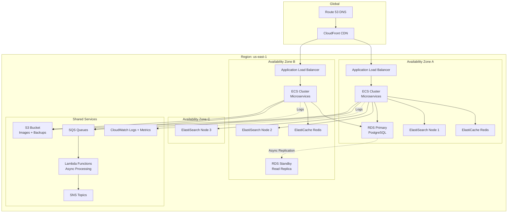

**AWS Service Justification:**

| Service | Purpose | Configuration | Cost Optimization |
|---------|---------|---------------|------------------|
| **Route 53** | DNS with health checks | Latency-based routing | Standard DNS |
| **CloudFront** | Global CDN for images | S3 origin, gzip compression | Standard class |
| **ALB** | Layer 7 load balancing | Cross-zone enabled, SSL/TLS termination | Shared across services |
| **ECS Fargate** | Container orchestration | Auto-scaling (10-100 tasks per service) | Fargate Spot for non-critical tasks |
| **RDS PostgreSQL** | Primary database | Multi-AZ, db.r6g.2xlarge, automated backups | Reserved instances |
| **ElastiCache Redis** | Caching layer | Cluster mode, 3 nodes, r6g.large | On-demand |
| **Elasticsearch Service** | Search engine | 3-node cluster, r6g.xlarge.search | Reserved instances |
| **S3** | Object storage | Standard class, lifecycle to Glacier after 90 days | Intelligent-Tiering |
| **SQS/SNS** | Message queue | Standard queue (not FIFO for cost) | Pay per use |
| **Lambda** | Event processing | Node.js 20, 512MB memory | Pay per invocation |
| **CloudWatch** | Monitoring | Logs, metrics, alarms | 30-day retention |

### 5.2 Scalability Strategy

**Horizontal Scaling:**

| Component | Scaling Trigger | Min Instances | Max Instances | Scale-Out Policy | Scale-In Policy |
|-----------|----------------|---------------|---------------|------------------|-----------------|
| **API Gateway** | N/A (AWS manages) | N/A | N/A | Auto | Auto |
| **Auth Service** | CPU > 70% | 2 | 20 | +2 instances | -1 instance every 5 min |
| **Search Service** | CPU > 70% | 3 | 30 | +3 instances | -1 instance every 5 min |
| **Booking Service** | CPU > 75% | 3 | 40 | +4 instances | -1 instance every 10 min |
| **Payment Service** | Queue depth > 100 | 2 | 15 | +2 instances | -1 instance every 10 min |
| **Hotel Service** | CPU > 70% | 2 | 20 | +2 instances | -1 instance every 5 min |
| **User Service** | CPU > 70% | 2 | 15 | +2 instances | -1 instance every 5 min |
| **Review Service** | CPU > 70% | 2 | 10 | +1 instance | -1 instance every 10 min |
| **Notification Service** | Queue depth > 500 | 3 | 50 | +5 instances | -2 instances every 5 min |
| **Analytics Service** | CPU > 70% | 1 | 5 | +1 instance | -1 instance every 15 min |

**Database Scaling:**
- **Vertical:** Start with db.r6g.2xlarge (8 vCPU, 64GB RAM), scale to db.r6g.8xlarge if needed
- **Read Replicas:** 2 read replicas for read-heavy queries (hotel details, search)
- **Connection Pooling:** PgBouncer with max 100 connections per service instance
- **Query Optimization:** Indexes, EXPLAIN ANALYZE, query caching

**Elasticsearch Scaling:**
- **Shard Strategy:** 3 primary shards, 2 replicas per shard (9 total shards)
- **Vertical:** r6g.xlarge.search (4 vCPU, 32GB RAM) per node
- **Horizontal:** Add nodes if cluster health degrades

**Load Testing Targets:**
- **100,000 concurrent users** (NFR-004)
- **10,000 requests per second** sustained
- **50,000 requests per second** peak (holiday booking rush)
- **<500ms p95 API response time** under load (NFR-006)

### 5.3 High Availability & Disaster Recovery

**High Availability Design:**

| Component | HA Strategy | Target Uptime | SPOF Eliminated |
|-----------|-------------|---------------|-----------------|
| **Application** | Multi-AZ ECS deployment | 99.99% | ✅ |
| **Database** | RDS Multi-AZ with auto-failover | 99.95% | ✅ |
| **Cache** | Redis cluster with replication | 99.9% | ✅ |
| **Search** | 3-node ES cluster across AZs | 99.9% | ✅ |
| **Load Balancer** | AWS ALB (managed service) | 99.99% | ✅ |
| **Object Storage** | S3 (11 9's durability) | 99.99% | ✅ |
| **DNS** | Route 53 (AWS SLA) | 100% | ✅ |

**Disaster Recovery Plan:**

| Scenario | RTO (Recovery Time Objective) | RPO (Recovery Point Objective) | Recovery Procedure | Requirements |
|----------|------------------------------|--------------------------------|-------------------|--------------|
| **AZ Failure** | < 5 minutes | 0 (synchronous replication) | Auto-failover to other AZ | NFR-011 |
| **Region Failure** | < 4 hours | < 1 hour | Manual failover to DR region | NFR-012 |
| **Database Corruption** | < 2 hours | < 15 minutes | Restore from automated snapshot | NFR-012 |
| **Security Breach** | < 8 hours | < 1 hour | Isolate, patch, restore from backup | NFR-011 |
| **Complete Data Loss** | < 24 hours | < 1 day | Restore from cross-region S3 backup | NFR-012 |

**Backup Strategy:**
- **Database:** Automated snapshots every 6 hours, retained for 30 days
- **Elasticsearch:** Daily snapshots to S3, retained for 7 days
- **S3 Images:** Cross-region replication to us-west-2
- **Backup Testing:** Quarterly restore drills

### 5.4 CI/CD Pipeline

```mermaid
graph LR
    Dev[Developer] -->|Push| GitHub[GitHub Repository]
    GitHub -->|Webhook| Actions[GitHub Actions]
    
    Actions --> Lint[Lint & Format<br/>ESLint, Prettier]
    Lint --> Test[Unit Tests<br/>Jest]
    Test --> Build[Build Docker Image]
    Build --> Scan[Security Scan<br/>Trivy, Snyk]
    Scan --> Push[Push to ECR]
    
    Push --> Deploy{Deploy Stage}
    
    Deploy -->|Auto| Dev[Dev Environment<br/>ECS]
    Deploy -->|Manual Approval| Staging[Staging Environment<br/>ECS]
    Staging -->|Smoke Tests| Prod[Production<br/>Blue-Green Deploy]
    
    Prod --> Monitor[CloudWatch + DataDog]
    Monitor -->|Alerts| PagerDuty[PagerDuty]
```

**Pipeline Stages:**

| Stage | Tools | Duration | Pass Criteria | Action on Failure |
|-------|-------|----------|---------------|------------------|
| **Lint** | ESLint, Prettier | 1 min | 0 errors | Block merge |
| **Unit Tests** | Jest | 3 min | > 80% coverage | Block merge |
| **Build** | Docker | 5 min | Build success | Block merge |
| **Security Scan** | Trivy (vulnerabilities), Snyk (dependencies) | 2 min | No critical CVEs | Block merge |
| **Push to ECR** | AWS CLI | 1 min | Image pushed | Retry 3 times |
| **Deploy to Dev** | Terraform, AWS CLI | 3 min | Health check pass | Rollback |
| **Integration Tests** | Playwright (E2E) | 10 min | All tests pass | Block staging |
| **Deploy to Staging** | Terraform, AWS CLI | 5 min | Health check pass | Rollback |
| **Smoke Tests** | Postman/Newman | 5 min | Critical flows work | Block prod |
| **Deploy to Prod** | Blue-green deployment | 10 min | Zero-downtime | Auto-rollback |

**Blue-Green Deployment:**
1. Deploy new version to "green" environment
2. Run smoke tests on green
3. Switch Route 53 traffic to green (50% → 100% over 10 minutes)
4. Monitor error rates and latency
5. Keep blue online for 24 hours for quick rollback
6. Decommission blue after validation

**Rollback Strategy:**
- **Automated:** If error rate > 1% or p95 latency > 1s
- **Manual:** On-call engineer can trigger via Slack bot
- **Process:** Switch traffic back to previous version in < 2 minutes

---

## 6. Security Architecture

### 6.1 Authentication & Authorization

**Authentication Flow:**

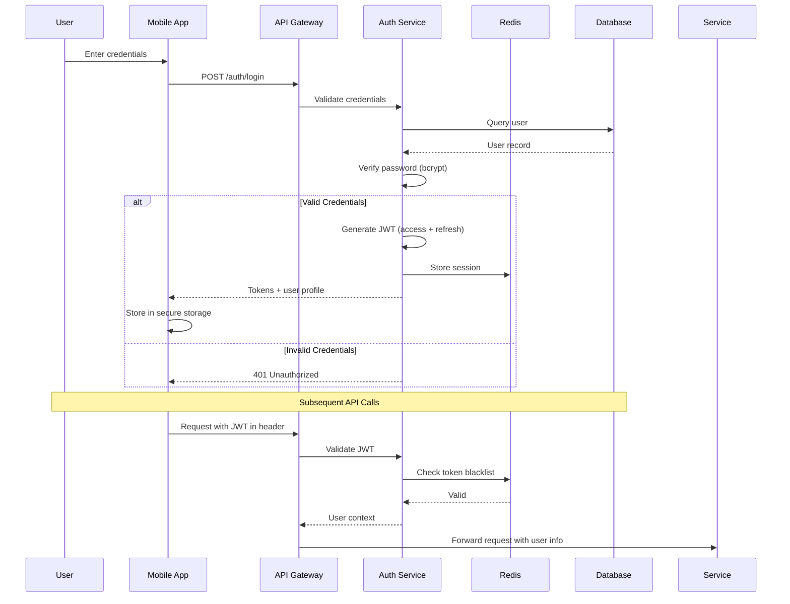

**JWT Token Structure:**
```json
{
  "header": {
    "alg": "RS256",
    "typ": "JWT"
  },
  "payload": {
    "sub": "user-uuid",
    "role": "customer",
    "email": "user@example.com",
    "iat": 1718625600,
    "exp": 1718626500
  },
  "signature": "..."
}
```

**Authorization Matrix:**

| Resource | Customer | Hotel Manager | Admin |
|----------|----------|---------------|-------|
| **View Hotels** | ✅ | ✅ | ✅ |
| **Create Booking** | ✅ | ❌ | ❌ |
| **Cancel Own Booking** | ✅ | ❌ | ✅ |
| **Manage Hotel Profile** | ❌ | ✅ (own hotel only) | ✅ |
| **View All Bookings** | ❌ | ✅ (own hotel only) | ✅ |
| **Approve Hotels** | ❌ | ❌ | ✅ |
| **Manage Users** | ❌ | ❌ | ✅ |
| **View Analytics** | ❌ | ✅ (own hotel only) | ✅ |

**Implementation:** Role-based access control (RBAC) with middleware checks

### 6.2 Data Encryption

| Data State | Encryption Method | Key Management | Compliance |
|------------|------------------|----------------|------------|
| **At Rest (Database)** | AES-256 encryption (RDS) | AWS KMS (automatic rotation) | GDPR, CCPA, PCI DSS |
| **At Rest (S3)** | SSE-S3 (AES-256) | AWS managed keys | GDPR, CCPA |
| **At Rest (Backups)** | AES-256 encryption | AWS KMS | GDPR, PCI DSS |
| **In Transit (API)** | TLS 1.3 | Let's Encrypt certificates (auto-renewed) | PCI DSS (NFR-008) |
| **In Transit (Internal)** | TLS 1.2+ | Private certificates | PCI DSS |
| **PII Fields** | Application-level AES-256 | AWS Secrets Manager | GDPR, CCPA (NFR-010) |
| **Payment Tokens** | Tokenization (Stripe/PayPal) | Provider managed | PCI DSS Level 1 (NFR-007) |

**Sensitive Data Handling:**
- **Email/Phone:** Encrypted at application level before DB storage
- **Credit Card:** Never stored; tokenized by Stripe/PayPal immediately
- **Passwords:** bcrypt hashing (cost factor 12, salted)
- **SSN/ID Numbers:** Not collected (out of scope for V1)

### 6.3 PCI DSS Compliance

**Compliance Strategy:**

| PCI DSS Requirement | Implementation | Responsibility |
|---------------------|----------------|----------------|
| **1. Firewall Configuration** | AWS Security Groups, Network ACLs | Platform (AWS) |
| **2. Secure Defaults** | No default passwords, CIS benchmarks | Dev Team |
| **3. Protect Stored Data** | No card data stored; Stripe tokens only | Platform (Stripe) |
| **4. Encrypt Transmission** | TLS 1.3 for all API communication | Dev Team + AWS |
| **5. Antivirus** | AWS GuardDuty for malware detection | Platform (AWS) |
| **6. Secure Systems** | Regular patching, vulnerability scans | Dev Team |
| **7. Restrict Access** | RBAC, least privilege principle | Dev Team |
| **8. Unique IDs** | UUID per user, audit logs | Dev Team |
| **9. Physical Access** | AWS data center security | Platform (AWS) |
| **10. Monitor Access** | CloudWatch logs, DataDog alerts | Dev Team |
| **11. Test Security** | Quarterly penetration tests | Security Team |
| **12. Information Security Policy** | Security playbook, incident response | Dev Team |

**Scope Reduction:** By using Stripe/PayPal for payment processing, the platform reduces PCI DSS scope to **Level 4 SAQ A** (easiest compliance tier).

### 6.4 GDPR & CCPA Compliance

**Data Privacy Controls:**

| Requirement | Implementation | API Endpoint |
|-------------|---------------|--------------|
| **Right to Access** | User can download all their data (JSON export) | `GET /api/v1/users/:id/data-export` |
| **Right to Rectification** | User can update profile information | `PUT /api/v1/users/:id` |
| **Right to Erasure (Delete)** | Hard delete user data (except legal holds) | `DELETE /api/v1/users/:id` |
| **Right to Portability** | Export data in machine-readable format (JSON) | `GET /api/v1/users/:id/data-export` |
| **Right to Object** | Opt-out of marketing communications | `PUT /api/v1/users/:id/preferences` |
| **Consent Management** | Explicit consent checkboxes during registration | Registration form |
| **Data Minimization** | Only collect necessary data (no SSN, etc.) | Database schema |
| **Breach Notification** | Automated alerts to DPO within 24 hours | CloudWatch alarms |

**Data Retention Policy:**
- **Active Users:** Indefinite retention
- **Inactive Users (no login >2 years):** Account archived, notifications sent
- **Deleted Accounts:** 30-day soft delete period, then hard delete (except legal holds)
- **Booking Records:** Retained for 7 years (tax compliance)
- **Payment Logs:** Retained for 10 years (financial regulations)

**Lawful Basis for Processing:**
- **Contract Performance:** Booking processing, payment
- **Consent:** Marketing communications, cookies
- **Legitimate Interest:** Fraud detection, analytics

### 6.5 Security Best Practices

**Application Security:**
- **Input Validation:** Joi schema validation on all API inputs
- **SQL Injection Prevention:** Parameterized queries (Knex.js ORM)
- **XSS Prevention:** Content Security Policy headers, output encoding
- **CSRF Protection:** CSRF tokens for state-changing operations
- **Rate Limiting:** 1000 requests per user per hour (API Gateway)
- **DDoS Protection:** AWS Shield Standard + CloudFlare
- **Secrets Management:** AWS Secrets Manager (no hardcoded credentials)
- **Dependency Scanning:** Snyk for vulnerable packages (weekly scans)
- **Code Scanning:** SonarQube for code quality and security issues

**Monitoring & Incident Response:**
- **SIEM:** Centralized logging in CloudWatch + DataDog
- **Anomaly Detection:** AWS GuardDuty for threat detection
- **Alerting:** PagerDuty for critical security events
- **Incident Response Plan:** 
  1. Detect (CloudWatch alarms)
  2. Assess (Security team investigation)
  3. Contain (Isolate affected services)
  4. Eradicate (Patch vulnerability)
  5. Recover (Restore from backup if needed)
  6. Lessons Learned (Post-mortem within 72 hours)

**Security Audits:**
- **Quarterly:** Penetration testing by third-party firm
- **Annual:** PCI DSS audit (if required)
- **Continuous:** Automated vulnerability scanning (Trivy, Snyk)

---

## 7. Non-Functional Requirements Mapping

### 7.1 Performance Requirements

| NFR ID | Requirement | Architectural Implementation | Validation Method |
|--------|-------------|------------------------------|-------------------|
| **NFR-001** | Search results < 2s | • Elasticsearch for sub-second queries<br/>• Redis caching for repeated searches<br/>• CDN for image thumbnails<br/>• Pagination (20 results per page) | Load testing with JMeter, p95 < 2s |
| **NFR-002** | Payment processing < 5s | • Async payment processing via queue<br/>• Stripe optimized API calls<br/>• Connection pooling to DB<br/>• No blocking operations | Transaction monitoring, p95 < 5s |
| **NFR-003** | Progressive image loading | • S3 + CloudFront CDN<br/>• Image compression (WebP format)<br/>• Lazy loading in mobile app<br/>• Thumbnail generation (Lambda) | Lighthouse performance score > 90 |
| **NFR-006** | Query response < 500ms at 80% capacity | • Database indexing (B-tree, GIN)<br/>• Read replicas for read-heavy queries<br/>• Connection pooling (PgBouncer)<br/>• Query optimization (EXPLAIN ANALYZE) | APM monitoring, p95 < 500ms |

### 7.2 Scalability Requirements

| NFR ID | Requirement | Architectural Implementation | Validation Method |
|--------|-------------|------------------------------|-------------------|
| **NFR-004** | 100K concurrent users | • ECS auto-scaling (10-100 tasks)<br/>• Multi-AZ deployment<br/>• Stateless services with Redis sessions<br/>• Horizontal scaling for all services | Load testing with 100K virtual users (Gatling) |
| **NFR-005** | Auto-scaling | • ECS auto-scaling based on CPU/memory<br/>• Notification service scales on queue depth<br/>• RDS read replicas<br/>• Elasticsearch 3-node cluster | CloudWatch metrics, auto-scale events logged |

### 7.3 Security Requirements

| NFR ID | Requirement | Architectural Implementation | Validation Method |
|--------|-------------|------------------------------|-------------------|
| **NFR-007** | PCI DSS Level 1 | • Stripe/PayPal tokenization (no card storage)<br/>• TLS 1.3 for all communication<br/>• Scope reduction to SAQ A<br/>• Quarterly PCI scans | PCI DSS compliance audit |
| **NFR-008** | HTTPS/TLS 1.3 | • ALB with TLS 1.3 termination<br/>• Let's Encrypt certificates (auto-renewed)<br/>• HSTS headers enforced<br/>• Certificate pinning in mobile app | SSL Labs A+ rating, Qualys SSL Test |
| **NFR-009** | JWT or OAuth 2.0 | • JWT with RS256 algorithm<br/>• 15-min access token, 7-day refresh token<br/>• OAuth 2.0 for Google/Facebook login<br/>• Token blacklist in Redis | Security audit, penetration testing |
| **NFR-010** | GDPR & CCPA compliance | • Data encryption (AES-256)<br/>• User data export API<br/>• Right to deletion (hard delete after 30 days)<br/>• Consent management in UI | Legal review, GDPR audit |

### 7.4 Availability Requirements

| NFR ID | Requirement | Architectural Implementation | Validation Method |
|--------|-------------|------------------------------|-------------------|
| **NFR-011** | 99.9% uptime | • Multi-AZ deployment (3 AZs)<br/>• RDS Multi-AZ auto-failover<br/>• Health checks + auto-healing<br/>• No single points of failure | Uptime monitoring (Pingdom), SLA reporting |
| **NFR-012** | RTO < 4h, RPO < 1h | • Automated DB snapshots (6-hour intervals)<br/>• Cross-region backups<br/>• DR runbook for manual failover<br/>• Quarterly DR drills | DR testing, restore time measurement |

### 7.5 Usability Requirements

| NFR ID | Requirement | Architectural Implementation | Validation Method |
|--------|-------------|------------------------------|-------------------|
| **NFR-013** | First booking < 5 min | • Intuitive UI/UX design (Material Design)<br/>• Auto-filled user data from profile<br/>• Saved payment methods<br/>• Clear CTAs and progress indicators | User testing, session recording (Hotjar) |
| **NFR-014** | WCAG 2.1 Level AA | • Semantic HTML<br/>• ARIA labels<br/>• Keyboard navigation support<br/>• Color contrast ratios > 4.5:1 | Axe accessibility testing, manual audit |
| **NFR-015** | Responsive design | • Flutter adaptive layouts<br/>• React responsive breakpoints<br/>• Touch-friendly UI (min 44x44 tap targets)<br/>• Tested on 4.7" to 13" screens | Device testing (BrowserStack) |

### 7.6 Notification Requirements

| NFR ID | Requirement | Architectural Implementation | Validation Method |
|--------|-------------|------------------------------|-------------------|
| **NFR-016** | Push notifications | • Firebase Cloud Messaging<br/>• Topic-based messaging<br/>• User preferences honored<br/>• Retry logic for failed sends | Delivery rate monitoring (FCM analytics) |
| **NFR-017** | Email delivery (99%, 1 min) | • SendGrid with 99.95% SLA<br/>• AWS SES as fallback<br/>• Webhook tracking<br/>• Retry logic | SendGrid analytics, delivery reports |
| **NFR-018** | SMS delivery (95%, 30s) | • Twilio with 99.95% SLA<br/>• Delivery receipts<br/>• Retry logic<br/>• Fallback to email | Twilio analytics, delivery logs |

### 7.7 Other Requirements

| NFR ID | Requirement | Architectural Implementation | Validation Method |
|--------|-------------|------------------------------|-------------------|
| **NFR-019** | Offline capability | • SQLite local database in mobile app<br/>• Cached booking details<br/>• Sync on reconnection | Offline testing, airplane mode |
| **NFR-020** | Code documentation | • JSDoc for all public APIs<br/>• API documentation (Swagger/OpenAPI)<br/>• Architectural Decision Records (ADRs)<br/>• README per service | Code review, documentation coverage |
| **NFR-021** | Mobile OS support | • Flutter targets iOS 14+, Android 8.0+<br/>• Regular OS compatibility testing | App store compatibility testing |
| **NFR-022** | Web browser support | • React with polyfills for older browsers<br/>• Chrome, Firefox, Safari, Edge (latest 2 versions)<br/>• Progressive enhancement | BrowserStack testing |

---

## 8. Architecture Decision Records (ADRs)

### ADR-01: Microservices Architecture

**Status:** Accepted  
**Date:** 2026-06-17  
**Decision Makers:** Solution Architect, Engineering Lead

**Context:**
The hotel booking platform requires independent scaling of components (search vs. payment vs. booking), independent deployment cycles, and team autonomy. We evaluated three architectural patterns:
1. Monolithic architecture
2. Microservices architecture
3. Hybrid (monolith with some microservices)

**Decision:**
We will adopt a **microservices architecture** with 9 core services: Auth, User, Hotel, Search, Booking, Payment, Review, Notification, Analytics.

**Rationale:**
- **Scalability:** Search and Booking services can scale independently based on demand
- **Resilience:** Failure in one service (e.g., Analytics) doesn't bring down critical paths (Booking)
- **Technology Flexibility:** Can use different tech stacks per service if needed (though we'll standardize on Node.js initially)
- **Team Autonomy:** Different teams can own services with clear boundaries
- **Deployment Velocity:** Deploy services independently without full platform downtime

**Consequences:**
- **Positive:**
  - Horizontal scaling per service (NFR-004, NFR-005)
  - Fault isolation (NFR-011)
  - Faster deployment cycles
  - Clear ownership boundaries
- **Negative:**
  - Increased operational complexity (monitoring, logging, tracing)
  - Network latency between services
  - Distributed transaction complexity (eventual consistency)
  - Higher infrastructure costs initially

**Alternatives Considered:**
- **Monolithic:** Simpler initially, but doesn't meet 100K concurrent user scaling requirement
- **Hybrid:** Adds complexity without full benefits of microservices

**Compliance:** NFR-004, NFR-005, NFR-011

---

### ADR-02: Flutter for Mobile App

**Status:** Accepted  
**Date:** 2026-06-17  
**Decision Makers:** Mobile Team Lead, Solution Architect

**Context:**
We need to support both iOS and Android with limited mobile development resources. Options:
1. Native development (Swift + Kotlin) - two codebases
2. React Native - single codebase, JavaScript
3. Flutter - single codebase, Dart

**Decision:**
We will use **Flutter 3.x** for mobile app development.

**Rationale:**
- **Single Codebase:** 90% code sharing between iOS and Android (faster development)
- **Performance:** Compiled to native code, smooth 60fps animations
- **UI Consistency:** Material Design and Cupertino widgets for platform-specific UX
- **Developer Experience:** Hot reload for rapid iteration
- **Ecosystem:** Strong package ecosystem (Dio for HTTP, Riverpod for state management)
- **Community:** Growing adoption, strong Google backing

**Consequences:**
- **Positive:**
  - Faster time-to-market (single codebase)
  - Native performance (NFR-001, NFR-002)
  - Consistent UX across platforms
  - Lower maintenance burden
- **Negative:**
  - Smaller talent pool than React Native
  - Dart is less common than JavaScript
  - Some platform-specific features require native modules

**Alternatives Considered:**
- **React Native:** Larger talent pool, but performance concerns for complex UI
- **Native (Swift + Kotlin):** Best performance, but 2x development effort

**Compliance:** NFR-021

---

### ADR-03: PostgreSQL for Primary Database

**Status:** Accepted  
**Date:** 2026-06-17  
**Decision Makers:** Solution Architect, Database Admin

**Context:**
We need a database for transactional data (bookings, payments, users). Requirements:
- ACID compliance for booking transactions
- Strong consistency
- Relational data model
- Geo-spatial queries for hotel search
- JSON support for flexible schemas (hotel amenities, metadata)

Options: PostgreSQL, MySQL, MongoDB, DynamoDB

**Decision:**
We will use **PostgreSQL 15** as the primary database, hosted on AWS RDS.

**Rationale:**
- **ACID Compliance:** Strong consistency for booking transactions (critical for inventory management)
- **JSON Support:** JSONB type for flexible schemas (hotel amenities, user preferences)
- **Geo-Spatial:** PostGIS extension for location-based queries
- **Performance:** Excellent indexing (B-tree, GIN, GiST)
- **Reliability:** Proven at scale, mature ecosystem
- **AWS Integration:** RDS Multi-AZ for high availability

**Consequences:**
- **Positive:**
  - Strong data integrity (no double-booking)
  - Advanced querying capabilities
  - Rich ecosystem (monitoring tools, ORMs)
  - PITR (Point-In-Time Recovery) backups
- **Negative:**
  - Vertical scaling limits (mitigated with read replicas)
  - More complex than NoSQL for horizontal scaling
  - Requires schema migrations

**Alternatives Considered:**
- **MySQL:** Similar features, but PostgreSQL has better JSON support and licensing (open source)
- **MongoDB:** Better horizontal scaling, but lacks ACID transactions (deal-breaker for bookings)
- **DynamoDB:** AWS-native, but complex data modeling and eventual consistency issues

**Compliance:** NFR-006, NFR-011

---

### ADR-04: Elasticsearch for Search

**Status:** Accepted  
**Date:** 2026-06-17  
**Decision Makers:** Solution Architect, Backend Lead

**Context:**
Hotel search requires:
- Full-text search (hotel name, description)
- Multi-faceted filters (price, rating, amenities, property type)
- Geo-spatial queries (map view, distance sorting)
- Sub-2-second response times (NFR-001)

Options: PostgreSQL full-text search, Elasticsearch, Algolia, AWS CloudSearch

**Decision:**
We will use **Elasticsearch 8** (AWS OpenSearch Service) for hotel search.

**Rationale:**
- **Performance:** Sub-second queries even with millions of hotels
- **Faceted Search:** Native support for filters and aggregations
- **Geo Queries:** Geo-point and geo-distance queries for map view
- **Relevance Scoring:** TF-IDF and BM25 for ranking
- **Scalability:** Horizontal scaling with sharding
- **Analytics:** Aggregations for search analytics

**Consequences:**
- **Positive:**
  - Meets <2s search requirement (NFR-001)
  - Rich filtering capabilities (REQ-010 to REQ-014)
  - Excellent geo-spatial support (REQ-019)
  - Built-in analytics
- **Negative:**
  - Eventual consistency (search index lags behind DB by seconds)
  - Operational complexity (cluster management)
  - Memory-intensive
  - Higher cost than PostgreSQL full-text search

**Alternatives Considered:**
- **PostgreSQL Full-Text:** Simpler, but slower for complex queries and lacks faceted search
- **Algolia:** Faster, but expensive at scale (SaaS pricing)
- **AWS CloudSearch:** Easier management, but less flexible than Elasticsearch

**Compliance:** NFR-001, REQ-009 to REQ-019

---

### ADR-05: Stripe and PayPal for Payments

**Status:** Accepted  
**Date:** 2026-06-17  
**Decision Makers:** Solution Architect, Finance Lead

**Context:**
Payment processing must be:
- PCI DSS Level 1 compliant (NFR-007)
- Support credit/debit cards, digital wallets
- Global reach (190+ countries eventually)
- Fraud detection
- Webhook support for async updates

Options: Stripe, PayPal, Braintree, Authorize.Net, Square

**Decision:**
We will integrate **Stripe** (primary) and **PayPal** (secondary) for payment processing.

**Rationale:**
- **PCI Compliance:** Both are Level 1 certified, handle tokenization
- **Payment Methods:** 
  - Stripe: Cards, Google Pay, Apple Pay
  - PayPal: PayPal wallet, cards
- **Fraud Detection:** Stripe Radar for risk scoring
- **Developer Experience:** Excellent APIs, SDKs, documentation
- **Global:** 190+ countries supported
- **Pricing:** Transparent, competitive (2.9% + $0.30 per transaction)

**Consequences:**
- **Positive:**
  - Reduced PCI scope (no card storage)
  - Strong fraud protection
  - Multiple payment methods (REQ-032, REQ-033)
  - Webhook integration for async updates
- **Negative:**
  - Vendor lock-in (mitigated with abstraction layer)
  - Transaction fees (2.9% + $0.30)
  - Two integrations to maintain

**Alternatives Considered:**
- **Braintree:** Similar to PayPal (owned by PayPal), but less popular
- **Authorize.Net:** More complex integration, older API
- **Square:** Focused on in-person payments, less suitable for online

**Compliance:** NFR-007, REQ-032, REQ-033, REQ-034

---

### ADR-06: Event-Driven Notifications via SQS/SNS

**Status:** Accepted  
**Date:** 2026-06-17  
**Decision Makers:** Solution Architect, Backend Lead

**Context:**
Notifications (email, SMS, push) must be:
- Asynchronous (not blocking booking flow)
- Reliable (retries on failure)
- Scalable (1000s of notifications per minute)
- Decoupled from booking/payment services

Options: Synchronous API calls, message queues (SQS, RabbitMQ, Kafka)

**Decision:**
We will use **AWS SQS (queues) and SNS (pub/sub)** for event-driven notifications.

**Rationale:**
- **Asynchronous:** Booking service publishes event, Notification service consumes
- **Reliability:** DLQ (Dead Letter Queue) for failed messages, automatic retries
- **Scalability:** Auto-scales to millions of messages
- **Decoupling:** Services don't need to know about each other
- **Cost:** Pay per use, no infrastructure to manage

**Consequences:**
- **Positive:**
  - Non-blocking booking flow (NFR-002)
  - Fault tolerance (retries, DLQs)
  - Scalability (NFR-005)
  - Service decoupling
- **Negative:**
  - Eventual consistency (notification may arrive seconds after booking)
  - Debugging complexity (distributed tracing needed)
  - Message duplication possible (idempotency required)

**Alternatives Considered:**
- **Synchronous API:** Simple, but blocks booking flow and no retries
- **RabbitMQ:** More features, but requires infrastructure management
- **Kafka:** Overkill for our use case, complex to operate

**Compliance:** NFR-016, NFR-017, NFR-018, REQ-035

---

### ADR-07: AWS as Cloud Provider

**Status:** Accepted  
**Date:** 2026-06-17  
**Decision Makers:** Solution Architect, DevOps Lead, CTO

**Context:**
We need a cloud provider for infrastructure. Requirements:
- High availability (99.9% uptime)
- Auto-scaling
- Managed services (DB, cache, search)
- Global presence (for future expansion)
- Cost-effective

Options: AWS, Google Cloud, Azure, DigitalOcean

**Decision:**
We will use **Amazon Web Services (AWS)** as our cloud provider.

**Rationale:**
- **Maturity:** Most mature cloud platform, proven at scale
- **Services:** Comprehensive service catalog (ECS, RDS, ElastiCache, OpenSearch, S3, Lambda)
- **Global Reach:** 30+ regions worldwide for future expansion
- **Ecosystem:** Largest ecosystem (tools, partners, talent)
- **Cost:** Competitive pricing with Reserved Instances and Spot
- **Support:** 24/7 support, extensive documentation

**Consequences:**
- **Positive:**
  - High availability with Multi-AZ (NFR-011)
  - Auto-scaling capabilities (NFR-005)
  - Managed services reduce operational burden
  - Strong security features (KMS, IAM, GuardDuty)
- **Negative:**
  - Vendor lock-in (mitigated with abstraction layers)
  - Cost can escalate without governance
  - Complex pricing model

**Alternatives Considered:**
- **Google Cloud:** Better Kubernetes support, but smaller ecosystem
- **Azure:** Good for .NET, but we're using Node.js
- **DigitalOcean:** Simpler, but lacks advanced managed services

**Compliance:** NFR-005, NFR-011, NFR-012

---

### ADR-08: Node.js for Backend Services

**Status:** Accepted  
**Date:** 2026-06-17  
**Decision Makers:** Solution Architect, Backend Team Lead

**Context:**
Backend microservices need:
- High concurrency (100K concurrent users)
- Fast JSON processing
- Async I/O for API calls (payment, maps, email)
- Strong ecosystem for integrations

Options: Node.js, Django (Python), Spring Boot (Java), Go, Ruby on Rails

**Decision:**
We will use **Node.js 20 LTS with Express framework** for all backend microservices.

**Rationale:**
- **Non-Blocking I/O:** Event loop handles high concurrency efficiently
- **JavaScript/TypeScript:** Single language across frontend (React) and backend
- **NPM Ecosystem:** 2M+ packages for integrations (Stripe, Twilio, SendGrid)
- **JSON Native:** Native JSON parsing (faster than Java/C#)
- **Performance:** V8 engine, comparable to Go for I/O-bound tasks
- **Ecosystem:** Mature frameworks (Express, NestJS), ORMs (Sequelize, TypeORM)

**Consequences:**
- **Positive:**
  - High concurrency (NFR-004)
  - Fast development (rich ecosystem)
  - Shared TypeScript types between frontend and backend
  - Large talent pool
- **Negative:**
  - Single-threaded (CPU-bound tasks are slow, but we're I/O-bound)
  - Callback hell (mitigated with async/await)
  - Memory leaks if not careful

**Alternatives Considered:**
- **Django (Python):** Great for rapid development, but slower for high concurrency
- **Spring Boot (Java):** Enterprise-grade, but heavier and slower development
- **Go:** Best performance, but smaller ecosystem and steeper learning curve
- **Ruby on Rails:** Rapid development, but slower runtime performance

**Compliance:** NFR-001, NFR-004

---

### ADR-09: Redis for Caching and Sessions

**Status:** Accepted  
**Date:** 2026-06-17  
**Decision Makers:** Solution Architect, Backend Lead

**Context:**
We need caching for:
- Hotel details (reduce DB load)
- Search results (repeated queries)
- Session storage (JWT validation)
- Rate limiting
- Distributed locking (inventory management)

Options: Redis, Memcached, Hazelcast, in-memory cache (Node.js)

**Decision:**
We will use **Redis 7 (AWS ElastiCache)** for caching and session storage.

**Rationale:**
- **Performance:** In-memory, sub-millisecond latency
- **Data Structures:** Strings, hashes, sets, sorted sets (versatile)
- **Persistence:** Optional AOF/RDB for durability
- **Pub/Sub:** Real-time features (future)
- **Distributed Locks:** RedLock for inventory locking
- **TTL:** Automatic key expiration

**Consequences:**
- **Positive:**
  - Reduced DB load (hotel details, search results)
  - Fast session validation (NFR-001)
  - Distributed locking for booking inventory
  - Rate limiting across instances
- **Negative:**
  - Eventual consistency (cache invalidation complexity)
  - Memory cost
  - Single point of failure (mitigated with Redis Cluster)

**Alternatives Considered:**
- **Memcached:** Faster, but lacks data structures and persistence
- **Hazelcast:** Distributed cache, but more complex and expensive
- **In-Memory (Node.js):** Simple, but not shared across instances

**Compliance:** NFR-001, NFR-006

---

### ADR-10: React for Web Admin Panels

**Status:** Accepted  
**Date:** 2026-06-17  
**Decision Makers:** Frontend Lead, Solution Architect

**Context:**
Two web panels needed:
1. Hotel Manager Panel (REQ-045 to REQ-053)
2. Super Admin Panel (REQ-054 to REQ-061)

Requirements:
- Reusable components (forms, tables, charts)
- Responsive design
- Fast development

Options: React, Vue.js, Angular, Svelte

**Decision:**
We will use **React 18 with TypeScript** for both web admin panels.

**Rationale:**
- **Component Reusability:** Share components between two panels (DRY)
- **Ecosystem:** Largest ecosystem (Material-UI, React Router, Redux)
- **Developer Experience:** Excellent tooling (React DevTools, Vite)
- **Performance:** Virtual DOM, code splitting
- **Talent Pool:** Most popular frontend framework
- **TypeScript:** Type safety for large codebases

**Consequences:**
- **Positive:**
  - Fast development with component libraries (Material-UI)
  - Strong type safety (TypeScript)
  - Shared components between panels
  - Large talent pool
- **Negative:**
  - Learning curve for React hooks and state management
  - Bundle size (mitigated with code splitting)

**Alternatives Considered:**
- **Vue.js:** Easier learning curve, but smaller ecosystem
- **Angular:** Enterprise-grade, but heavier and opinionated
- **Svelte:** Fastest, but smallest ecosystem and talent pool

**Compliance:** NFR-022, REQ-045 to REQ-061

---

## 9. Risk Assessment

### 9.1 Technical Risks

| Risk | Likelihood | Impact | Mitigation Strategy | Contingency Plan |
|------|-----------|--------|-------------------|------------------|
| **Scalability Bottleneck** | Medium | High | • Load testing before launch<br/>• Auto-scaling policies tested<br/>• Database read replicas<br/>• Elasticsearch cluster sizing | • Vertical scaling (larger instances)<br/>• Caching layer tuning<br/>• Rate limiting aggressive users |
| **Payment Gateway Downtime** | Low | Critical | • Dual gateway (Stripe + PayPal)<br/>• Fallback logic<br/>• Monitor gateway status | • Manual "pay at hotel" option<br/>• Queue payments for retry<br/>• Customer communication |
| **Search Performance Degradation** | Medium | High | • Elasticsearch cluster monitoring<br/>• Query optimization<br/>• Index sharding strategy | • Fallback to DB search (slower)<br/>• Scale up ES cluster<br/>• Simplify filters temporarily |
| **Database Connection Pool Exhaustion** | Medium | High | • PgBouncer connection pooling<br/>• Connection limits per service<br/>• Monitoring and alerts | • Increase pool size<br/>• Kill long-running queries<br/>• Scale up RDS instance |
| **Redis Cache Failure** | Low | Medium | • Redis cluster (not single node)<br/>• Automatic failover<br/>• Cache-aside pattern (fallback to DB) | • App continues with DB queries<br/>• Spin up new Redis cluster |
| **Third-Party API Rate Limits** | Medium | Medium | • Monitor API usage<br/>• Respect rate limits<br/>• Caching for maps/geocoding | • Fallback to cached data<br/>• Upgrade API plan<br/>• Batch requests |
| **JWT Token Compromise** | Low | Critical | • Short token expiry (15 min)<br/>• Token blacklist on logout<br/>• HTTPS only<br/>• Certificate pinning (mobile) | • Force re-authentication<br/>• Revoke compromised tokens<br/>• Incident response plan |
| **Data Loss (DB Corruption)** | Very Low | Critical | • Automated snapshots (6-hour interval)<br/>• Cross-region backups<br/>• PITR (Point-In-Time Recovery) | • Restore from latest snapshot<br/>• RPO < 1 hour<br/>• DR runbook |

### 9.2 Operational Risks

| Risk | Likelihood | Impact | Mitigation Strategy | Contingency Plan |
|------|-----------|--------|-------------------|------------------|
| **Deployment Failure** | Medium | High | • Blue-green deployment<br/>• Automated rollback<br/>• Smoke tests in staging | • Rollback to previous version<br/>• Fix forward if minor issue |
| **Monitoring Blind Spots** | Medium | Medium | • Comprehensive logging (CloudWatch)<br/>• APM (DataDog)<br/>• Synthetic monitoring | • Manual investigation<br/>• Enhanced monitoring post-incident |
| **On-Call Burnout** | Medium | Medium | • PagerDuty rotation<br/>• Clear escalation paths<br/>• Auto-remediation (restarts) | • Expand on-call team<br/>• Reduce alert noise |
| **Documentation Drift** | High | Low | • Documentation in code (JSDoc)<br/>• ADRs for decisions<br/>• API docs auto-generated (Swagger) | • Documentation sprint<br/>• Onboarding bottleneck |
| **Key Person Dependency** | Medium | Medium | • Knowledge sharing sessions<br/>• Pair programming<br/>• Documentation | • Hire backup expertise<br/>• Consultant engagement |

### 9.3 Business Risks

| Risk | Likelihood | Impact | Mitigation Strategy | Contingency Plan |
|------|-----------|--------|-------------------|------------------|
| **Low Hotel Adoption** | Medium | Critical | • Incentive program (reduced commission)<br/>• Dedicated onboarding team<br/>• Easy-to-use hotel panel | • Pivot to select cities<br/>• Partner with hotel aggregators |
| **User Trust Issues** | Medium | High | • Secure payment badges (Stripe logo)<br/>• User reviews for social proof<br/>• Transparent cancellation policies | • Marketing campaign<br/>• Money-back guarantee |
| **Competitive Pressure** | High | Medium | • Unique value prop (better UX)<br/>• Competitive pricing<br/>• Niche focus initially | • Pivot to underserved markets<br/>• Add differentiated features (V2) |
| **Regulatory Changes** | Low | High | • Legal review of T&Cs<br/>• GDPR/CCPA compliance<br/>• Monitor regulations | • Adapt to new regulations<br/>• Legal consultation |
| **Payment Fraud** | Medium | High | • Stripe Radar (fraud detection)<br/>• 3D Secure for European cards<br/>• Manual review for suspicious bookings | • Refund fraudulent charges<br/>• Ban user accounts<br/>• Insurance |

### 9.4 Security Risks

| Risk | Likelihood | Impact | Mitigation Strategy | Contingency Plan |
|------|-----------|--------|-------------------|------------------|
| **Data Breach (User PII)** | Low | Critical | • Encryption at rest (AES-256)<br/>• TLS 1.3 in transit<br/>• Principle of least privilege<br/>• Regular security audits | • Incident response plan<br/>• GDPR breach notification (72h)<br/>• Credit monitoring for affected users |
| **DDoS Attack** | Medium | High | • AWS Shield Standard<br/>• CloudFlare DDoS protection<br/>• Rate limiting (API Gateway) | • Enable AWS Shield Advanced<br/>• Blacklist attacking IPs<br/>• Scale up infrastructure |
| **SQL Injection** | Low | High | • Parameterized queries (Knex.js ORM)<br/>• Input validation (Joi)<br/>• Code scanning (SonarQube) | • Patch vulnerability immediately<br/>• Review all queries<br/>• Security audit |
| **Insider Threat** | Very Low | Critical | • RBAC (least privilege)<br/>• Audit logs for all admin actions<br/>• Background checks | • Revoke access immediately<br/>• Forensic investigation<br/>• Legal action |
| **Supply Chain Attack (npm packages)** | Low | Medium | • Snyk for vulnerability scanning<br/>• Dependabot for updates<br/>• Lock file integrity checks | • Remove vulnerable package<br/>• Find alternative<br/>• Patch manually |

---

## 10. Open Questions

### 10.1 Business & Product Questions

| Question | Stakeholder | Impact | Urgency |
|----------|------------|--------|---------|
| **Commission Model:** Fixed rate (e.g., 10%) or tiered based on volume? | Finance, Business | High (revenue model) | High |
| **Refund Timing:** Platform handles refunds or hotel direct? How long (5-7 days)? | Finance, Legal | High (cash flow) | High |
| **Hotel Verification:** What documents required? Turnaround time (24h, 72h)? | Operations | Medium (onboarding speed) | Medium |
| **Multi-Currency Support Timeline:** V1 (USD only) or V2 feature? | Product, Finance | Medium (global expansion) | Low |
| **Loyalty Program:** Points-based or discount-based? V1 or V2? | Product, Marketing | Low (nice-to-have) | Low |

### 10.2 Technical Questions

| Question | Stakeholder | Impact | Urgency |
|----------|------------|--------|---------|
| **Real-Time Inventory:** Sync with hotel PMS (Property Management System) in V1 or V2? | Engineering, Product | High (availability accuracy) | High |
| **Data Residency:** EU data stored in EU region for GDPR compliance? | Legal, DevOps | High (compliance) | High |
| **Mobile App Distribution:** Public app stores or enterprise MDM? | Product, IT | High (distribution) | High |
| **A/B Testing Framework:** Google Optimize, LaunchDarkly, or custom? | Product, Engineering | Medium (experimentation) | Medium |
| **Chat Support:** In-app live chat (Intercom, Zendesk) or email-only for V1? | Product, Support | Medium (customer experience) | Medium |

### 10.3 Operational Questions

| Question | Stakeholder | Impact | Urgency |
|----------|------------|--------|---------|
| **Support Hours:** 24/7 or business hours (9 AM - 9 PM) for V1? | Operations, Finance | High (customer satisfaction) | High |
| **Manual Review Moderation:** Delay before publishing (24h) or instant publish? | Operations, Product | Medium (review quality) | Medium |
| **Dispute Resolution:** Dedicated team or admin panel? SLA for resolution? | Operations, Legal | High (conflict management) | High |
| **Hotel Onboarding:** Self-service or white-glove onboarding? | Operations, Sales | Medium (scalability) | Medium |
| **Backup Testing Frequency:** Quarterly or monthly DR drills? | DevOps, Engineering | Low (preparedness) | Low |

---

## 11. Requirement Coverage Summary

### Functional Requirements Coverage

| Requirement Category | Requirements | Architectural Components | Status |
|---------------------|--------------|-------------------------|---------|
| **Authentication & User Management** | REQ-001 to REQ-008 | Auth Service, User Service, JWT, OAuth 2.0 | ✅ Fully Addressed |
| **Hotel Search & Discovery** | REQ-009 to REQ-019 | Search Service, Elasticsearch, Maps API | ✅ Fully Addressed |
| **Hotel Details & Information** | REQ-020 to REQ-027 | Hotel Service, S3 + CloudFront, Review Service | ✅ Fully Addressed |
| **Booking & Payment** | REQ-028 to REQ-037 | Booking Service, Payment Service, Stripe/PayPal | ✅ Fully Addressed |
| **Post-Booking Features** | REQ-038 to REQ-044 | Booking Service, Review Service, Notification Service | ✅ Fully Addressed |
| **Hotel Owner/Manager Panel** | REQ-045 to REQ-053 | Hotel Service, Analytics Service, React Web App | ✅ Fully Addressed |
| **Super Admin Panel** | REQ-054 to REQ-061 | Admin functions in all services, Analytics Service | ✅ Fully Addressed |

**Total: 61 Functional Requirements Addressed**

### Non-Functional Requirements Coverage

| NFR Category | Requirements | Architectural Implementation | Status |
|--------------|--------------|------------------------------|---------|
| **Performance** | NFR-001 to NFR-003 | Elasticsearch, Redis, CloudFront CDN | ✅ Fully Addressed |
| **Scalability** | NFR-004 to NFR-006 | ECS auto-scaling, Multi-AZ, Read replicas | ✅ Fully Addressed |
| **Security** | NFR-007 to NFR-010 | Stripe/PayPal, TLS 1.3, JWT, GDPR compliance | ✅ Fully Addressed |
| **Availability** | NFR-011 to NFR-012 | Multi-AZ, RDS Multi-AZ, DR plan | ✅ Fully Addressed |
| **Usability** | NFR-013 to NFR-015 | Flutter Material Design, React responsive, WCAG | ✅ Fully Addressed |
| **Notifications** | NFR-016 to NFR-018 | FCM, SendGrid, Twilio, SQS event processing | ✅ Fully Addressed |
| **Offline Capability** | NFR-019 | SQLite local storage in Flutter app | ✅ Fully Addressed |
| **Maintainability** | NFR-020 | JSDoc, Swagger, ADRs, CI/CD | ✅ Fully Addressed |
| **Compatibility** | NFR-021 to NFR-022 | Flutter (iOS 14+, Android 8.0+), React (modern browsers) | ✅ Fully Addressed |

**Total: 22 Non-Functional Requirements Addressed**

---

## 12. Next Steps

### Phase 3: Implementation Planning

After architecture approval, the **Technical Lead** will:
1. Break down architecture into implementation tasks
2. Create detailed technical specifications per service
3. Estimate effort (story points) for each component
4. Define sprint plan (assuming 2-week sprints)
5. Identify critical path and dependencies

### Phase 4: Development

**Sprint 0 (Infrastructure Setup):**
- Set up AWS account, VPC, subnets, security groups
- Deploy ECS cluster, RDS (PostgreSQL), ElastiCache (Redis), OpenSearch
- Configure CI/CD pipeline (GitHub Actions)
- Set up monitoring (CloudWatch, DataDog)

**Sprint 1-2 (Core Services):**
- Auth Service (JWT, OAuth)
- User Service (profile management)
- Hotel Service (CRUD operations)

**Sprint 3-4 (Search & Booking):**
- Search Service (Elasticsearch integration)
- Booking Service (inventory management)
- Payment Service (Stripe integration)

**Sprint 5-6 (Mobile App):**
- Flutter app setup
- Search and hotel details screens
- Booking flow

**Sprint 7-8 (Admin Panels):**
- React admin panel setup
- Hotel manager dashboard
- Super admin dashboard

**Sprint 9-10 (Testing & Launch):**
- Load testing (100K users)
- Security audit
- Soft launch (beta users)
- Production launch

### Phase 5: Quality Assurance

- **Unit Testing:** 80% code coverage (Jest for Node.js, Flutter test for mobile)
- **Integration Testing:** API contract tests (Postman/Newman)
- **E2E Testing:** Playwright for web, Flutter integration tests for mobile
- **Load Testing:** Gatling for 100K concurrent users
- **Security Testing:** OWASP ZAP, Snyk, penetration testing

---

## Appendix A: Technology Versions

| Technology | Version | EOL Date | Upgrade Path |
|------------|---------|----------|--------------|
| Flutter | 3.x | TBD | Follow stable channel |
| React | 18.x | N/A | Incremental upgrades |
| Node.js | 20 LTS | 2026-04-30 | Migrate to Node.js 22 LTS |
| PostgreSQL | 15 | 2027-11-11 | Upgrade to PG 16/17 |
| Redis | 7.x | N/A | Follow stable releases |
| Elasticsearch | 8.x | N/A | Follow major releases |
| TypeScript | 5.x | N/A | Incremental upgrades |

## Appendix B: Glossary

| Term | Definition |
|------|------------|
| **ADR** | Architecture Decision Record - documented design decisions |
| **ACID** | Atomicity, Consistency, Isolation, Durability (database properties) |
| **AZ** | Availability Zone (AWS data center) |
| **CDN** | Content Delivery Network (CloudFront) |
| **DLQ** | Dead Letter Queue (failed messages) |
| **JWT** | JSON Web Token (authentication) |
| **PCI DSS** | Payment Card Industry Data Security Standard |
| **PITR** | Point-In-Time Recovery (database backups) |
| **RPO** | Recovery Point Objective (acceptable data loss) |
| **RTO** | Recovery Time Objective (acceptable downtime) |
| **SLA** | Service Level Agreement |
| **TTL** | Time To Live (cache expiration) |

---

**Document End**

**Approval Required From:**
- ✅ CTO / Engineering VP
- ✅ Product Owner
- ✅ Security Lead
- ✅ DevOps Lead

**Revision History:**
- 2026-06-17: Version 1.0 - Initial architecture design
